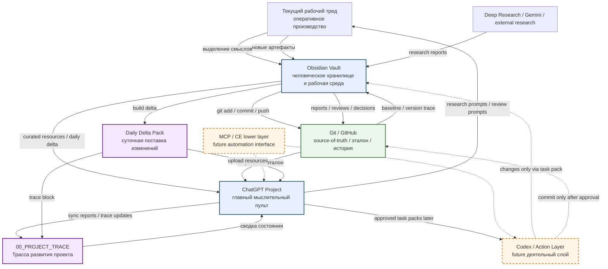

# TEMPORARY REGULATION — Documentation and Flow Synchronization v0.1  
## Временное положение о документировании и синхронизации потоков IPaC

```yaml
artifact_id: TEMP-REGULATION-IPAC-DOCUMENTATION-FLOW-SYNC-001
artifact_type: project_rule
status: temporary_operational_regulation
version: 0.1
layer: project_rules / documentation_and_sync
scope: Obsidian / Git / ChatGPT Project / current thread / daily delta / future MCP automation
date: 2026-06-14
canon_update_authorized: false
field_validated: process_observed
temporary: true
revision_right_reserved: true
```

---

# 1. Назначение

Это временное положение фиксирует текущий порядок документирования и синхронизации потоков между:

```text
Git / GitHub
Obsidian Vault
ChatGPT Project
Текущий рабочий тред
Project Trace Chat
Daily Delta Pack
future Codex / MCP automation layer
```

Документ является временным и будет уточняться по мере поискового проектирования.

Рабочий принцип:

```text
Принимаем за основу.
Движение покажет, на что стоит тратить время и ресурсы.
Оставляем за собой право на корректировки.
```

---

# 2. Ключевая архитектурная схема



---

# 3. Роли основных контуров

## 3.1 Obsidian Vault

```text
Obsidian = human-facing knowledge workspace.
```

Назначение:

- хранит человекочитаемые артефакты;
- поддерживает семантическую структуру;
- связывает notes / reviews / decisions / rules / research;
- является рабочей средой архитектора;
- готовит артефакты к Git-фиксации.

Obsidian — не просто файловая папка.  
Это слой человеческого восприятия и смысловой навигации.

---

## 3.2 Git / GitHub

```text
Git = source-of-truth / эталон / трасса изменений.
```

Назначение:

- фиксирует принятые состояния;
- показывает drift через `git status` и `git diff`;
- защищает от случайных изменений;
- хранит историю решений;
- делает знание воспроизводимым.

Рабочая формула:

```text
git diff = Жизнь − Эталон
```

---

## 3.3 ChatGPT Project

```text
Project = главный мыслительный пульт.
```

Назначение:

- держит актуальную картину проекта;
- работает с крупными смысловыми блоками;
- участвует в review / decision preparation;
- помогает выбирать research sprints;
- готовит будущую связку с Codex / action layer.

Project не должен превращаться в склад всех файлов.  
В Project должны попадать только крупные смысловые блоки и актуальные ресурсы.

---

## 3.4 Current Thread

```text
Текущий тред = оперативный производственный канал.
```

Назначение:

- быстрые обсуждения;
- рождение смыслов;
- формирование артефактов;
- пошаговая Git-проводка;
- техническое сопровождение.

Текущий тред не является долговременным source-of-truth.  
Ценные смыслы должны отчуждаться в Obsidian / Git / Project.

---

## 3.5 Project Trace Chat

```text
Project Trace = лента развития проекта.
```

Назначение:

- принимает Daily Trace;
- фиксирует изменения состояния;
- не анализирует подробно;
- не заменяет Vault;
- помогает Project не терять историческую траекторию.

Рабочая формула:

```text
Трасса не спорит.
Трасса фиксирует.
```

---

## 3.6 Daily Delta Pack

```text
Daily Delta Pack = суточная поставка изменений в Project.
```

Назначение:

- собрать новые ресурсы дня;
- подготовить prompts для Project;
- дать связный trace;
- синхронизировать Project с Obsidian / Git.

Delta Pack — не новый центр проекта.  
Это транспортная поставка изменений.

---

## 3.7 Future Codex / MCP Layer

```text
Codex / MCP = будущий деятельный и интерфейсный слой.
```

Статус:

```text
future automation layer
not yet authorized for uncontrolled execution
```

MCP / Context Engineering lower layer может позже автоматизировать:

- resource sync;
- input pack generation;
- task pack execution;
- file movement;
- status checks;
- Git-safe operations.

Но только после:

```text
approved task pack;
clear allowed actions;
forbidden actions;
verification steps;
rollback plan;
human approval.
```

---

# 4. Принцип отчуждения

Отчуждение — это перевод смысла из оперативного диалога в устойчивый артефакт.

```text
тредовая мысль
→ нормализованный файл
→ правильное место в Vault
→ Git commit
→ Project sync if needed
→ trace entry
```

Смысл считается отчуждённым, если:

1. У него есть файл.
2. У файла есть корректное имя.
3. Файл лежит в правильной папке Vault.
4. У файла есть status / artifact type / version.
5. Файл проведён через Git.
6. Working tree clean.
7. Если файл важен для Project — он включён в Daily Delta / Resources.
8. Если файл меняет состояние проекта — он отражён в Project Trace.

---

# 5. Краткая инструкция к отчуждению

## Шаг 1. Выделить смысл

Определить, что именно родилось:

```text
research report
review
decision
rule
ontology note
source dossier
daily trace
tool script
prompt
delta pack
```

## Шаг 2. Назначить тип артефакта

Пример:

```text
artifact_type: research_review
artifact_type: decision_record
artifact_type: project_rule
artifact_type: source_dossier
artifact_type: daily_trace
```

## Шаг 3. Определить место в Vault

Примеры:

```text
03_RESEARCH_MAP/deep_research/
03_RESEARCH_MAP/deep_research/design/
03_RESEARCH_MAP/deep_research/source_dossiers/
06_PROJECT_RULES/
06_PROJECT_RULES/research_protocol/
08_TRACE_AND_DECISIONS/reviews/
08_TRACE_AND_DECISIONS/decisions/
08_TRACE_AND_DECISIONS/session_notes/
00_START_HERE/tools/
```

## Шаг 4. Положить файл

Файл должен иметь нормальное имя:

```text
DR-002_COMPARATIVE_RESEARCH_REVIEW_v0_1.md
DECISION_DR002_IPAC_CONTEXT_ENGINEERING_BOUNDARY_v0_1.md
RULE_SOURCE_QUALITY_GATE_v0_1.md
DAILY_TRACE_2026-06-13_DR002_CONTEXT_ENGINEERING_v0_1.md
```

## Шаг 5. Проверить drift

```powershell
git status
git diff --stat
```

Если есть неожиданный modified-файл — сначала разобраться.

## Шаг 6. Провести смысловой commit

```powershell
git add <target-file-or-folder>
git status
git commit -m "<type>: <one semantic operator>"
git push
git status
```

Рабочее правило:

```text
Один commit = один смысловой оператор.
```

## Шаг 7. Синхронизировать Project

Если артефакт меняет состояние Project:

```text
добавить в Daily Delta;
обновить Project Resources;
добавить trace block в 00_PROJECT_TRACE;
запустить Project State Sync при необходимости.
```

---

# 6. Project root layout

В Project должны быть только крупные смысловые блоки.

Предлагаемый root layout:

```text
00_NAVIGATION_AND_CURRENT_STATE
01_CANON_AND_POSITIONING
02_RESEARCH_PROTOCOL
03_DR001_KNOWLEDGE_ENGINEERING
04_DR002_CONTEXT_ENGINEERING
05_ACTION_LAYER_CODEX
06_PROJECT_TRACE_INDEX
```

Не загружать в root:

```text
generated ZIP packs
99_ATTACHMENTS_AND_EXPORTS
temporary folders
raw downloads
duplicated input packs
intermediate scratch files
```

---

# 7. Daily Delta structure

Рекомендуемая структура суточной дельты:

```text
PROJECT_DELTA_YYYY-MM-DD_TOPIC/
├── 00_DAILY_TRACE/
├── 01_UPLOAD_TO_PROJECT_RESOURCES/
├── 02_PROMPTS_FOR_PROJECT_CHATS/
├── 03_ARTIFACT_LIST/
└── 04_NOTES_FOR_SYNC/
```

Пример:

```text
PROJECT_DELTA_2026-06-13_DR002_CONTEXT_ENGINEERING/
```

---

# 8. Постоянные чаты Project

## 8.1 `00_PROJECT_TRACE — Трасса развития проекта`

Назначение:

```text
лента развития проекта;
daily trace;
sync milestones;
major shifts.
```

## 8.2 `01_PROJECT_STATE — Актуальное состояние`

Назначение:

```text
сверка Project с Vault/Git;
current accepted state;
open debts;
next steps.
```

## 8.3 `02_RESEARCH_FACTORY — Исследовательский станок`

Назначение:

```text
research designs;
source dossiers;
input packs;
reviews;
next sprint selection.
```

## 8.4 `03_ACTION_LAYER — Codex / Tooling / Task Packs`

Назначение:

```text
Codex readiness;
task pack templates;
allowed / forbidden actions;
future automation.
```

---

# 9. Temporary status and revision right

Этот документ временный.

```text
TEMPORARY_OPERATIONAL_REGULATION
```

Он принимается как рабочая основа, но может быть изменён после практической проверки.

Правило:

```text
Поисковое проектирование.
Движение покажет.
Оставляем за собой право корректировки.
```

---

# 10. Recommended placement

```text
06_PROJECT_RULES/DOCUMENTATION_AND_FLOW_SYNC_TEMPORARY_REGULATION_v0_1.md
```

---

# 11. Commit recommendation

```powershell
git add .\06_PROJECT_RULES\DOCUMENTATION_AND_FLOW_SYNC_TEMPORARY_REGULATION_v0_1.md
git commit -m "rules: add temporary documentation and flow sync regulation"
git push
git status
```

---

# 12. Status

```text
TEMPORARY_REGULATION_READY_FOR_USE
APPLIES_TO_PROJECT_SYNC_AND_DAILY_DELTA
REVISION_RIGHT_RESERVED
CANON_LOCKED
```
