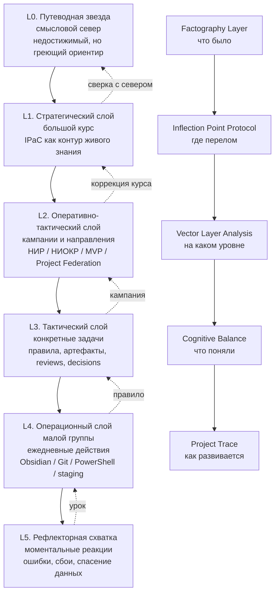

# RULE — Multilayer Vector Navigation v0.1
## Правило многослойной векторной навигации IPaC

```yaml
artifact_id: RULE-MULTILAYER-VECTOR-NAVIGATION-001
artifact_type: project_rule
status: active_candidate_rule
version: 0.1
layer: project_rules / operational_governance / navigation_and_trace
scope: IPaC navigation / project movement analysis / daily trace / cognitive balance / project federation / rule writing discipline
date: 2026-06-17
canon_update_authorized: false
field_validated: process_observed
revision_right_reserved: true
related_rules:
  - 06_PROJECT_RULES/FACTOGRAPHY_INTERPRETATION_AND_REVISABLE_KNOWLEDGE_RULE_v0_1.md
  - 06_PROJECT_RULES/SEARCH_DESIGN_AND_COGNITIVE_BALANCE_RULE_v0_1.md
  - 06_PROJECT_RULES/INFLECTION_POINT_PROTOCOL_RULE_v0_1.md
```

---

# 1. Назначение

Это правило фиксирует многослойную векторную модель анализа продвижения IPaC.

Тред показывает не только содержание работы, но и траекторию движения между уровнями:

```text
Путеводная звезда
→ Стратегия
→ Оперативно-тактический слой
→ Тактика
→ Операционный бой малой группы
→ Рефлекторная схватка
```

Без такой модели движение в треде может выглядеть как хаотическое рыскание, хотя на самом деле это может быть управляемое продвижение через разные уровни.

---

# 2. Главный принцип

```text
Перед анализом продвижения необходимо различить уровни движения.
```

Иначе возникает риск:

```text
принять рефлекторную суету за стратегию;
принять тактический манёвр за стратегический дрейф;
не заметить, что малый операционный сбой породил большое новое правило;
не увидеть связь между малой схваткой и путеводной звездой.
```

---

# 3. Многослойная векторная модель

## 3.1 Слой 0 — Путеводная звезда

```text
Путеводная звезда — это смысловой север.
```

Она не обязана быть достижимой целью.

Её функция:

```text
греть мысль;
держать направление;
помогать не потерять высший смысл;
давать ориентир, даже если он недостижим полностью.
```

Для IPaC это может быть:

```text
инженерия информационного производства;
знаниевая операционная система;
снижение смысловой сложности;
управляемое производство живого знания.
```

## 3.2 Слой 1 — Стратегический слой

Отвечает на вопрос:

```text
Куда идём в большом горизонте?
```

Примеры:

```text
IPaC как human-AI framework;
IPaC как operating contour of living knowledge;
IPaC как кандидат в дисциплину;
IPaC как путь к инженерии информационного производства.
```

## 3.3 Слой 2 — Оперативно-тактический слой

Отвечает на вопрос:

```text
Какие кампании и направления ведём?
```

Примеры:

```text
DR-001 Knowledge Engineering boundary;
DR-002 Context Engineering boundary;
Factography Layer;
Project Federation;
Control OS;
Thread Export / Obsidian / Git pipeline.
```

## 3.4 Слой 3 — Тактический слой

Отвечает на вопрос:

```text
Какие конкретные задачи решаем?
```

Примеры:

```text
создать правило;
провести Git;
разобрать thread export;
подготовить Project OS;
создать prompt library;
сформировать daily trace.
```

## 3.5 Слой 4 — Операционный слой малой группы

Отвечает на вопрос:

```text
Что делаем руками сегодня?
```

Примеры:

```text
PowerShell-команды;
перенос файлов;
staging;
проверка Obsidian;
git status;
git add;
git commit;
git push;
проверка images / Mermaid / Markdown.
```

## 3.6 Слой 5 — Рефлекторная схватка

Отвечает на вопрос:

```text
Как реагируем на сбой в моменте?
```

Примеры:

```text
PowerShell завис в here-string;
Git показывает untracked;
тред тормозит;
надо срочно спасать данные;
надо не смешать 14.06 и 17.06;
надо остановиться и не коммитить всё подряд.
```

---

# 4. Обратная связь между слоями

Движение не идёт только сверху вниз. Нижние слои дают материал для верхних.

```text
Рефлекторная схватка
→ операционный урок
→ тактическое правило
→ оперативно-тактический контур
→ стратегическая корректировка
→ сверка с путеводной звездой
```

Малый сбой может породить большое правило.

Пример:

```text
PowerShell here-string завис
→ нужно оформлять длинные операции как .ps1
→ появляется операционное правило
→ усиливается дисциплина Codex/MCP layer
→ укрепляется стратегия IPaC как инженерного контура знания.
```

---

# 5. Точка перегиба и векторный слой

Каждая значимая точка перегиба должна быть отнесена к векторному уровню.

Формат:

```markdown
- [ ] YYYY-MM-DD HH:mm — <точка перегиба>
      Vector layer: L0 / L1 / L2 / L3 / L4 / L5
      Type: inflection_point / cognitive_system_event / operational_governance_event
      What changed: <что изменилось>
      Why it matters: <почему важно>
      Upper vector served: <какой верхний вектор обслуживает>
      Resulting action: <какое действие или правило возникло>
      Include in: DAILY_TRACE_YYYY-MM-DD
```

Это позволяет отличать:

```text
рыскание;
манёвр;
сбой;
тактическое продвижение;
стратегический перегиб;
приближение к путеводной звезде.
```

---

# 6. Трёхслойное оформление правил

Каждое важное правило IPaC должно быть пригодно одновременно для трёх потребителей:

```text
1. Человек.
2. ИИ.
3. Obsidian.
```

## 6.1 Слой для человека

Правило должно отвечать:

```text
что делать;
когда делать;
зачем делать;
чего не делать;
какой смысл у правила;
какой практический пример.
```

Человек должен понимать не только инструкцию, но и смысловую рамку.

## 6.2 Слой для ИИ

Правило должно отвечать:

```text
как распознать ситуацию;
какую классификацию применить;
какой шаблон записи выдать;
какой артефакт предложить;
какие ограничения соблюдать;
что не объявлять каноном;
когда предложить Git-проводку;
когда предупредить о риске.
```

ИИ должен использовать правило как операционный распознаватель и генератор корректных действий.

## 6.3 Слой для Obsidian

Obsidian-слой должен обеспечивать:

```text
онтологию;
семантику;
топологию;
типологику.
```

Правило должно быть не только текстом, но и узлом в знаниевой сети.

---

# 7. Obsidian as Ontology / Semantics / Topology / Typology

## 7.1 Онтология

Правило должно явно показывать:

```text
какие сущности вводятся;
какие слои различаются;
какие типы событий или артефактов появляются;
что является объектом управления.
```

Для этого правила сущности:

```text
Путеводная звезда;
стратегический слой;
оперативно-тактический слой;
тактический слой;
операционный слой;
рефлекторный слой;
точка перегиба;
вектор движения;
когнитивная дельта.
```

## 7.2 Семантика

Правило должно фиксировать смысл:

```text
зачем это различение нужно;
какую ошибку оно предотвращает;
какое качество мышления оно усиливает.
```

Семантика этого правила:

```text
движение проекта нельзя оценивать плоско;
надо видеть слой, на котором произошло событие;
малые события могут иметь высокоуровневый смысл;
стратегический дрейф и тактический манёвр нельзя смешивать.
```

## 7.3 Топология

Правило должно быть связано с другими узлами проекта:

```text
Factography Layer;
Inflection Point Protocol;
Daily Trace;
Cognitive Balance;
Project Federation;
Control OS;
Git Diff discipline;
Project Trace.
```

Топология показывает, куда правило подключается.

## 7.4 Типологика

Правило должно вводить типы:

```text
L0_guiding_star_event;
L1_strategic_event;
L2_operational_tactical_campaign_event;
L3_tactical_task_event;
L4_operational_action_event;
L5_reflexive_fight_event;
inflection_point;
cognitive_ascent_event;
vector_layer_shift;
```

Типологика нужна, чтобы в будущем агенты могли классифицировать события и строить отчёты.

---

# 8. СтекИруемость, связность и валентность

## 8.1 СтекИруемость

```text
Сжатый смысл правила должен быть стекИруемым.
```

Это означает:

```text
правило можно положить поверх других правил;
оно не разрушает нижние слои;
оно усиливает уже существующие различения;
его можно использовать как строительный блок для следующих правил.
```

Пример стекИруемости:

```text
Factography Layer
→ Inflection Point Protocol
→ Multilayer Vector Navigation
→ Daily Cognitive Balance
→ Project Federation
```

## 8.2 Связность

```text
Связность всегда побеждает неконсолидированную силу и массу.
```

В IPaC ценность правила определяется не только его содержанием, но и тем, насколько оно связывает:

```text
факты;
смыслы;
артефакты;
решения;
слои;
процессы;
будущие действия.
```

Сильный, но несвязанный документ менее ценен, чем более компактное правило, которое правильно подключено к сети.

## 8.3 Валентность

```text
Валентность правила — это его способность образовывать связи с другими правилами, артефактами и процессами.
```

Метафора из химии:

```text
правило должно иметь свободные валентности;
оно должно быть способно сцепляться с новыми контекстами;
оно должно не замыкаться на себе, а входить в реакции с системой.
```

Высоковалентное правило:

```text
используется в Daily Trace;
помогает ИИ классифицировать события;
помогает человеку не терять смысл;
имеет место в Obsidian topology;
готово для будущей автоматизации Codex/MCP.
```

---

# 9. Mermaid-схема



---

# 10. Применение в Daily Trace

Daily Trace должен содержать раздел:

```markdown
## Vector Layer Analysis
```

Шаблон:

```markdown
## Vector Layer Analysis

### L0 — Путеводная звезда
Что сегодня напомнило о высшем ориентире?

### L1 — Стратегия
Изменилась ли стратегическая рамка?

### L2 — Оперативно-тактический слой
Какие кампании продвинулись?

### L3 — Тактика
Какие задачи решены?

### L4 — Операционный слой
Какие действия выполнены?

### L5 — Рефлекторная схватка
Какие сбои, реакции, спасательные действия были важны?

### Inflection points
Какие точки перегиба зафиксированы?

### Cognitive ascent
Какие переходы качества понимания произошли?
```

---

# 11. Практическое правило для ИИ

При анализе треда ИИ должен не только суммировать содержание, но и классифицировать события по слоям.

Для каждого значимого события ИИ должен задавать вопросы:

```text
На каком векторном уровне это произошло?
Это рыскание, манёвр, перегиб или продвижение?
Какую верхнюю цель это обслуживает?
Какая нижняя фактография это подтверждает?
Какую связь это создаёт в Obsidian?
Какую валентность имеет возникшее правило?
```

---

# 12. Практическое правило для человека

Человек должен использовать многослойную модель как навигационную карту.

Если кажется, что тред “рыскает”, надо спросить:

```text
На каком слое мы сейчас?
Это рефлекторная схватка или стратегический дрейф?
Эта операция обслуживает какой верхний вектор?
Нужна ли фиксация точки перегиба?
```

---

# 13. Анти-паттерны

## 13.1 Плоский анализ

```text
Все события рассматриваются как одинаковые.
```

Ошибка: теряется слой.

## 13.2 Стратегизация мелочи

```text
Мелкий технический сбой объявляется стратегическим событием без основания.
```

Ошибка: возникает шум.

## 13.3 Обесценивание малой схватки

```text
Операционный сбой игнорируется, хотя из него родилось правило.
```

Ошибка: теряется источник развития.

## 13.4 Потеря связности

```text
Правило оформлено как текст, но не связано с онтологией, семантикой, топологией и типологикой.
```

Ошибка: правило не стекИруется и не имеет валентности.

---

# 14. Ключевые формулы

```text
Путеводная звезда не обязательно достижима.
Но мысль о ней греет и держит направление.
```

```text
Тред показывает не только содержание работы,
но и траекторию движения между слоями.
```

```text
Чтобы понять, продвигаемся мы или мечемся,
нужно задать многослойную векторную модель движения.
```

```text
Малый операционный сбой может породить большое правило.
```

```text
Связность всегда побеждает неконсолидированную силу и массу.
```

```text
Валентность правила — это его способность образовывать связи.
```

```text
Сжатый смысл должен быть стекИруемым.
```

---

# 15. Recommended placement

```text
06_PROJECT_RULES/MULTILAYER_VECTOR_NAVIGATION_RULE_v0_1.md
```

---

# 16. Commit recommendation

```powershell
git status

git add .\06_PROJECT_RULES\MULTILAYER_VECTOR_NAVIGATION_RULE_v0_1.md

git status

git commit -m "rules: add multilayer vector navigation rule"

git push

git status
```

---

# 17. Future work

Нужно переиздать / усилить правило написания правил IPaC:

```text
RULE_RULE_WRITING_DISCIPLINE_v0_2
```

С учётом обязательных трёх слоёв:

```text
для человека;
для ИИ;
для Obsidian.
```

И с обязательными требованиями:

```text
онтология;
семантика;
топология;
типологика;
стекИруемость;
связность;
валентность.
```

---

# 18. Status

```text
MULTILAYER_VECTOR_NAVIGATION_RULE_READY_FOR_USE
APPLIES_TO_DAILY_TRACE_COGNITIVE_BALANCE_AND_PROJECT_TRACE
REVISION_RIGHT_RESERVED
CANON_LOCKED
FIELD_VALIDATION_IN_PROGRESS
```
