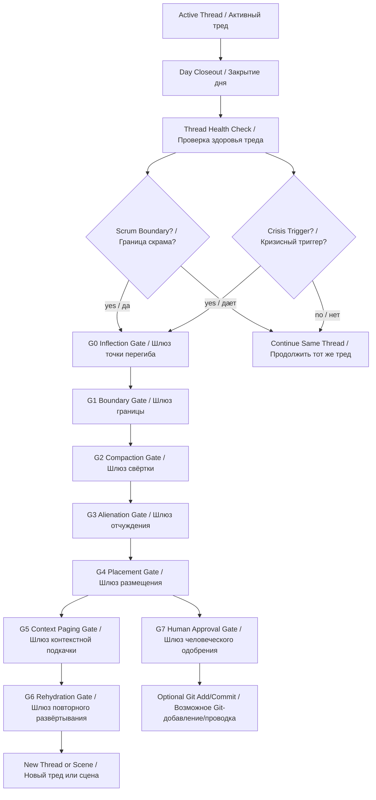
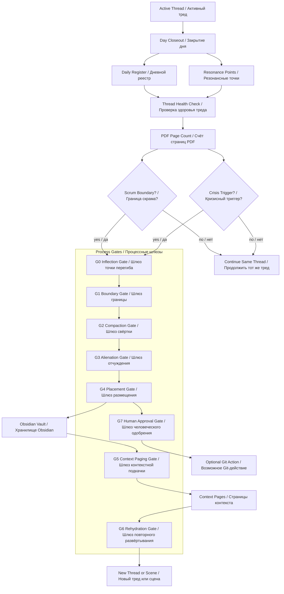

# ALL-IN-ONE — Process Regulation Semantic Thread Compaction and Rehydration
## Единый файл процессного положения смысловой свёртки треда и повторного развёртывания

```yaml
status: candidate
canon_status: not_canon
created: 2026-06-24
```


---


# Process Regulation — Semantic Thread Compaction and Rehydration
## Процессное положение — смысловая свёртка треда и повторное развёртывание

```yaml
artifact_id: PROCESS-REGULATION-SEMANTIC-THREAD-COMPACTION-REHYDRATION-2026-06-24-v0.1
artifact_type: process_regulation_candidate / процессное положение-кандидат
project: IPaC_NIR_SEMANTIC_OS
parent_frame: IPaC OS Architecture Candidate (архитектурный кандидат IPaC OS)
source_subsystem: Semantic Thread Compaction and Rehydration (смысловая свёртка треда и повторное развёртывание)
status: candidate
canon_status: not_canon
created: 2026-06-24
authority: advisory / candidate_only
human_approval_required_for_git_commit: true
git_commit_authorized: false
promotion_allowed: false
```

---

# 0. Status Guard (статусный предохранитель)

Этот документ имеет статус **candidate (кандидат)** и **not canon (не канон)**.

Он не является canon (каноном), final standard (финальным стандартом), approved rule (утверждённым правилом) или разрешением на Git commit (Git-проводку).

Документ создаётся как ответ на advisory review (рекомендательное рассмотрение) внешнего консультанта, который указал, что подсистему Semantic Thread Compaction and Rehydration (смысловая свёртка треда и повторное развёртывание) нужно усилить не стилем, а воспроизводимым process regulation (процессным положением), gate structure (структурой шлюзов), rollback (откатом), QA (контролем качества) и evidence requirements (требованиями к свидетельствам).

---

# 1. Назначение

Process Regulation (процессное положение) определяет порядок управления Thread (тредом), Semantic Compaction (смысловой свёрткой), Alienation (отчуждением), placement (размещением), Virtual Context Paging (виртуальной контекстной подкачкой) и Rehydration (повторным развёртыванием) в IPaC OS (IPaC смысловой ОС).

Главная задача:

```text
не допустить внезапного разрастания Thread (треда)
до состояния когнитивного и операционного торможения,
при этом не обрубать Thread (тред) преждевременно.
```

---

# 2. Corrected Calibration (исправленная калибровка)

Предыдущая ошибочная трактовка:

```text
Day Closeout (закрытие дня) = Thread Cut (отсечение треда)
```

Исправленная трактовка:

```text
Day Closeout (закрытие дня) ≠ Thread Cut (отсечение треда)

Day Closeout (закрытие дня):
  ежедневная фиксация состояния, резонансов, поворотных точек,
  открытых долгов и следующего фокуса.

Thread Cut (отсечение треда):
  смысловое закрытие крупного рабочего цикла,
  выполняется по Scrum Boundary (границе скрама)
  или при критическом состоянии Thread Health (здоровья треда).
```

---

# 3. Scope (область действия)

Process Regulation (процессное положение) применяется к:

```text
1. Browser Thread (браузерный тред)
   текущая временная смысловая сцена проектирования.

2. Day Gate (дневной шлюз)
   календарно-операционный шлюз закрытия / открытия дня.

3. Scrum Boundary (граница скрама)
   крупная смысловая граница, на которой допустимо закрытие Thread (треда).

4. Semantic Thread Compaction (смысловая свёртка треда)
   операция отделения смысловых инвариантов от тредового шума.

5. Obsidian Vault (хранилище Obsidian)
   Associative Memory Subsystem (подсистема ассоциативной памяти).

6. Virtual Context Paging (виртуальная контекстная подкачка)
   подкачка наиболее резонансных Context Pages (страниц контекста).

7. Scene-based Agentic Work (сценовая агентная работа)
   целевой режим Codex (Кодекс), Claude (Клод), Antigravity (АнтиГравити)
   и multi-agent interaction (мультиагентного взаимодействия).
```

---

# 4. Roles (роли)

```text
Human Architect (человеческий архитектор)
  принимает решения о статусе, направлении, Git add (Git-добавлении),
  Git commit (Git-проводке), promotion (повышении статуса)
  и canonization (канонизации).

Supervisor (супервизор)
  отслеживает Thread Health (здоровье треда), держит Mainline (магистраль),
  фиксирует Branches (ветки), запускает Semantic Compaction (смысловую свёртку),
  готовит artifacts (артефакты), QA (контроль качества) и placement (размещение).

Executor (исполнитель)
  выполняет scripts (скрипты), placement (размещение), verify (проверку),
  generation (генерацию) и возвращает LOG (журнал).

Reviewer (рецензент)
  проводит review (рассмотрение), выявляет gaps (разрывы),
  risks (риски), failure modes (режимы отказа) и improvement roadmap
  (дорожную карту улучшений).

Agent / Multi-agent System (агент / мультиагентная система)
  будущий исполнитель Scene (сцены), Task Pack (пакета задач),
  Verification Log (журнала проверки) и controlled execution
  (контролируемого исполнения).
```

---

# 5. Thread Health Metrics (метрики здоровья треда)

Основная метрика текущего этапа:

```text
PDF Page Count (счёт страниц PDF-документа)
```

Пороговые зоны:

```text
0–700 PDF pages (страниц PDF):
  рабочая зона;
  Thread (тред) можно продолжать;
  обязательна ежедневная регистрация резонансов.

700–1200 PDF pages (страниц PDF):
  зона внимания;
  Supervisor (супервизор) усиливает Daily Resonance Register
  (ежедневный реестр резонансов) и Open Debts (открытые долги).

1200–2000 PDF pages (страниц PDF):
  зона подготовки к Scrum Closeout (закрытию скрама);
  нужно заранее готовить Semantic Compaction (смысловую свёртку),
  Context Pages (страницы контекста), Evidence Index (индекс свидетельств)
  и Rehydration Brief (бриф повторного развёртывания).

2000+ PDF pages (страниц PDF):
  crisis zone (кризисная зона);
  высок риск внезапного торможения;
  требуется Thread Stabilization (стабилизация треда)
  и подготовка Thread Cut (отсечения треда).
```

Дополнительные признаки деградации:

```text
- latency / degradation signal (сигнал замедления / деградации);
- topic divergence (расхождение тем);
- status mixing (смешивание статусов);
- open debt growth (рост открытых долгов);
- repeated context restoration (повторное восстановление контекста);
- branch overload (перегрузка ветками);
- evidence loss risk (риск потери свидетельств);
- premature canonization risk (риск преждевременной канонизации).
```

---

# 6. Trigger Policy (политика триггеров)

## 6.1 Day Closeout Trigger (триггер закрытия дня)

Запускается ежедневно.

Действия:

```text
1. Зафиксировать Daily Register (Дневной реестр).
2. Зафиксировать Resonance Points (резонансные точки).
3. Зафиксировать Inflection Points (точки перегиба).
4. Зафиксировать Open Debts (открытые долги).
5. Зафиксировать Next Focus (следующий фокус).
6. Thread (тред) не отсекать автоматически.
```

## 6.2 Branch Parking Trigger (триггер парковки ветки)

Запускается, когда обнаружена сильная боковая ветка.

Действия:

```text
1. Назвать Branch (ветку).
2. Описать why_resonant (почему резонансна).
3. Оценить risk_if_followed_now (риск разворачивания сейчас).
4. Отправить в Parking Lot (парковку) или Backlog (бэклог).
5. Вернуться к Mainline (магистрали).
```

## 6.3 Scrum Boundary Trigger (триггер границы скрама)

Запускается, когда закрывается крупный смысловой цикл.

Действия:

```text
1. Закрыть Scrum (скрам) как смысловой цикл.
2. Провести Semantic Compaction (смысловую свёртку).
3. Создать Resource Pack (ресурсный пакет).
4. Создать Rehydration Brief (бриф повторного развёртывания).
5. Открыть новый Thread (тред) только после transfer (переноса) компетенций.
```

## 6.4 Crisis Thread Trigger (кризисный триггер треда)

Запускается при критической деградации.

Действия:

```text
1. Остановить expansion (разворачивание) новых ветвей.
2. Перейти в Thread Stabilization Mode (режим стабилизации треда).
3. Создать Emergency Compaction Brief (аварийный бриф свёртки).
4. Подготовить Thread Cut (отсечение треда).
5. Не выполнять Git commit (Git-проводку) без Human Approval (человеческого одобрения).
```

---

# 7. Process Gates (процессные шлюзы)

## G0 — Inflection Gate (шлюз точки перегиба)

Вопрос:

```text
Возникла ли точка, после которой Thread (тред) нельзя вести как раньше?
```

PASS (проход), если зафиксированы:

```text
- причина перегиба;
- влияние на Mainline (магистраль);
- риск продолжения без фиксации;
- recommended routing (рекомендуемая маршрутизация).
```

## G1 — Boundary Gate (шлюз границы сегмента)

Вопрос:

```text
Где проходит граница текущего смыслового сегмента?
```

PASS (проход), если определены:

```text
- source segment (исходный сегмент);
- excluded noise (исключённый шум);
- included decisions (включённые решения);
- included debts (включённые долги);
- continuation target (цель продолжения).
```

## G2 — Compaction Gate (шлюз свёртки)

Вопрос:

```text
Сохранена ли working semantic capability (рабочая смысловая способность)?
```

PASS (проход), если свёртка содержит:

```text
- factography (фактографию);
- interpretation (интерпретацию), явно отделённую от фактов;
- decisions (решения) с их статусами;
- open debts (открытые долги);
- source artifacts (исходные артефакты);
- evidence (свидетельства);
- next actions (следующие действия);
- forbidden carry-over noise (запрещённый перенос шума);
- required context pages (обязательные страницы контекста).
```

## G3 — Alienation Gate (шлюз отчуждения)

Вопрос:

```text
Смысл выведен из Thread (треда) в переносимую форму?
```

PASS (проход), если созданы:

```text
- Markdown Artifact (Markdown-артефакт);
- Resource Entry (ресурсная запись);
- MANIFEST (манифест);
- QA Review (отчёт контроля качества);
- Placement Script (скрипт размещения), если нужен;
- SHA256 (контрольные суммы SHA256), если формируется пакет.
```

## G4 — Placement Gate (шлюз размещения)

Вопрос:

```text
Artifact (артефакт) реально размещён в Obsidian Vault (хранилище Obsidian)?
```

PASS (проход), если известны:

```text
- target path (целевой путь);
- placement result (результат размещения);
- Git status (статус Git);
- status block (блок статуса);
- review location (место рассмотрения), если применимо.
```

## G5 — Context Paging Gate (шлюз контекстной подкачки)

Вопрос:

```text
Какие Context Pages (страницы контекста) нужны следующей Scene (сцене)?
```

PASS (проход), если определены:

```text
- required pages (обязательные страницы);
- optional pages (дополнительные страницы);
- forbidden noise (запрещённый шум);
- page budget (бюджет страниц);
- stale pages (устаревшие страницы);
- conflict pages (конфликтующие страницы).
```

## G6 — Rehydration Gate (шлюз повторного развёртывания)

Вопрос:

```text
Новый Thread (тред) или Scene (сцена) восстановили рабочую способность?
```

PASS (проход), если восстановлены:

```text
- active focus (активный фокус);
- status boundaries (границы статуса);
- open debts (открытые долги);
- next actions (следующие действия);
- prohibitions (запреты);
- required context pages (обязательные страницы контекста);
- distinction between factography / interpretation / decision / canon
  (различение фактографии / интерпретации / решения / канона).
```

## G7 — Human Approval Gate (шлюз человеческого одобрения)

Вопрос:

```text
Дал ли Human Architect (человеческий архитектор) отдельное разрешение?
```

PASS (проход), если явно указано:

```text
- разрешён ли targeted Git add (точечное Git-добавление);
- разрешён ли Git commit (Git-проводка);
- разрешено ли promotion (повышение статуса);
- разрешена ли canonization (канонизация).
```

---

# 8. Inputs and Outputs (входы и выходы)

## Входы

```text
- active Thread (активный тред);
- Day Gate (дневной шлюз);
- Daily Register (Дневной реестр);
- Resonance Points (резонансные точки);
- Inflection Points (точки перегиба);
- Consultant Review (консультантское рассмотрение);
- Resource Pack (ресурсный пакет);
- Obsidian Vault (хранилище Obsidian);
- Git status (статус Git);
- Human Approval (человеческое одобрение), если требуется.
```

## Выходы

```text
- Semantic Compaction Brief (бриф смысловой свёртки);
- Thread Segment Closeout (закрытие сегмента треда);
- Resource Entry (ресурсная запись);
- Context Page (страница контекста);
- Rehydration Brief (бриф повторного развёртывания);
- Scene Candidate (кандидат сцены);
- Agent Task Pack (агентный пакет задач);
- QA Review (отчёт контроля качества);
- Placement Log (журнал размещения).
```

---

# 9. Daily Operating Mode (ежедневный операционный режим)

В течение дня:

```text
1. Держать Mainline (магистраль).
2. Фиксировать Branches (ветки), но не разворачивать без решения.
3. Регистрировать Resonance Points (резонансные точки).
4. Регистрировать Inflection Points (точки перегиба).
5. Отчуждать крупные смысловые сгустки в artifacts (артефакты).
6. Не смешивать Day Closeout (закрытие дня) и Thread Cut (отсечение треда).
```

В конце дня:

```text
1. Закрыть Day Gate (дневной шлюз).
2. Обновить Daily Register (Дневной реестр).
3. Записать Open Debts (открытые долги).
4. Записать Next Focus (следующий фокус).
5. Thread (тред) продолжить, если нет Scrum Boundary (границы скрама)
   или Crisis Thread Trigger (кризисного триггера треда).
```

---

# 10. Scrum Closeout Mode (режим закрытия скрама)

Scrum Closeout (закрытие скрама) выполняется, когда завершён крупный смысловой цикл.

Минимальный набор:

```text
1. Scrum Summary (сводка скрама).
2. Semantic Compaction Brief (бриф смысловой свёртки).
3. Evidence Index (индекс свидетельств).
4. Resource Pack (ресурсный пакет).
5. Context Page Set (набор страниц контекста).
6. Rehydration Brief (бриф повторного развёртывания).
7. New Thread Start Anchor (якорь начала нового треда).
```

---

# 11. Rollback (откат)

Rollback (откат) применяется, если:

```text
- Semantic Compaction (смысловая свёртка) потеряла важный смысл;
- Rehydration (повторное развёртывание) восстановило неверный фокус;
- Context Paging (контекстная подкачка) подкачала шум;
- artifact (артефакт) размещён неверно;
- статус candidate (кандидат) был ошибочно прочитан как canon (канон).
```

Операции отката:

```text
1. Mark Failed (пометить как неудачное).
2. Create Correction Report (создать отчёт исправления).
3. Reopen Source Segment (переоткрыть исходный сегмент).
4. Update Resource Entry (обновить ресурсную запись).
5. Invalidate Context Page (инвалидировать страницу контекста).
6. Re-run QA (повторить контроль качества).
```

---

# 12. QA Requirements (требования к контролю качества)

Любой процессный artifact (артефакт) должен проходить QA (контроль качества):

```text
[ ] status: candidate (кандидат)
[ ] canon_status: not_canon (не канон)
[ ] factography (фактография) отделена от interpretation (интерпретации)
[ ] decisions (решения) имеют статус
[ ] open debts (открытые долги) выписаны
[ ] next actions (следующие действия) указаны
[ ] forbidden noise (запрещённый шум) указан
[ ] Git commit (Git-проводка) не авторизована без Human Approval (человеческого одобрения)
[ ] placement (размещение) указано
[ ] rollback path (путь отката) указан
```

---

# 13. Evidence Requirements (требования к свидетельствам)

Для повышения доверия каждый значимый artifact (артефакт) должен иметь:

```text
- provenance (происхождение);
- source Thread (исходный тред) или source artifact (исходный артефакт);
- Evidence Index (индекс свидетельств), если есть несколько источников;
- QA Review (отчёт контроля качества);
- Placement Log (журнал размещения), если выполнялось размещение;
- Git status (статус Git), если artifact (артефакт) попал в Vault (хранилище);
- Human Approval (человеческое одобрение), если требуется действие Git (Git).
```

---

# 14. Relation to Scene-based Agentic Work (связь со сценовой агентной работой)

Этот процесс не предназначен для вечного улучшения Browser Thread (браузерного треда).

Он предназначен для перехода к:

```text
Scene (сцене);
Context Page (странице контекста);
Agent Task Pack (агентному пакету задач);
Execution Protocol (протоколу исполнения);
Verification Log (журналу проверки);
Codex / Claude / Antigravity (Кодексу / Клоду / АнтиГравити);
multi-agent interaction (мультиагентному взаимодействию).
```

Browser Thread (браузерный тред) остаётся design forge (кузницей проектирования), а не целевой операционной средой.

---

# 15. Placement Recommendation (рекомендация размещения)

```text
Primary:
  11_COS_ARCHITECTURE_PROJECT_DECISIONS/04_PROCESS_DECISIONS/
  PROCESS_REGULATION_SEMANTIC_THREAD_COMPACTION_REHYDRATION_candidate_v0_1.md

Review:
  08_TRACE_AND_DECISIONS/reviews/
  QA_PROCESS_REGULATION_SEMANTIC_THREAD_COMPACTION_REHYDRATION_2026-06-24_v0_1.md

Source Package:
  09_SOURCE_PACKAGES/semantic_thread_compaction_rehydration_process_regulation/

Scripts:
  09_SOURCE_PACKAGES/scripts/
```

---

# 16. Final Status (итоговый статус)

```text
process_regulation_status:
  candidate (кандидат)

canon_status:
  not_canon (не канон)

ready_for_review:
  yes

git_commit_authorized:
  false

next_documents:
  - FAILURE_MODE_REGISTER_SEMANTIC_THREAD_COMPACTION_REHYDRATION_candidate_v0_1.md
  - CONTEXT_PAGING_POLICY_SEMANTIC_THREAD_COMPACTION_REHYDRATION_candidate_v0_1.md
  - SEMANTIC_COMPACTION_SCHEMA_candidate_v0_1.md
```


---


# Appendix A — Process Gates for Semantic Thread Compaction and Rehydration
## Приложение A — процессные шлюзы смысловой свёртки треда и повторного развёртывания

```yaml
artifact_id: APPENDIX-A-PROCESS-GATES-SEMANTIC-THREAD-COMPACTION-REHYDRATION-2026-06-24-v0.1
artifact_type: appendix_candidate / process_gates
status: candidate
canon_status: not_canon
parent_document: PROCESS_REGULATION_SEMANTIC_THREAD_COMPACTION_REHYDRATION_candidate_v0_1.md
created: 2026-06-24
```

---

# A1. Gate Table (таблица шлюзов)

| Gate (шлюз) | Назначение | PASS (проход) | FAIL (сбой) |
|---|---|---|---|
| G0 — Inflection Gate (шлюз точки перегиба) | Понять, что ситуация изменилась | Перегиб назван и маршрутизирован | Перегиб проигнорирован |
| G1 — Boundary Gate (шлюз границы) | Определить границу сегмента | Включения и исключения названы | Сегмент размыт |
| G2 — Compaction Gate (шлюз свёртки) | Сохранить рабочую смысловую способность | Факты, решения, долги, статусы сохранены | Получился summary (краткий пересказ) |
| G3 — Alienation Gate (шлюз отчуждения) | Вывести смысл в artifact (артефакт) | Есть Markdown Artifact (Markdown-артефакт), Resource Entry (ресурсная запись), QA (контроль качества) | Смысл остался только в Thread (треде) |
| G4 — Placement Gate (шлюз размещения) | Разместить в Vault (хранилище) | Путь и статус известны | Artifact (артефакт) потерян или осиротел |
| G5 — Context Paging Gate (шлюз контекстной подкачки) | Выбрать Context Pages (страницы контекста) | Есть required pages (обязательные страницы) и forbidden noise (запрещённый шум) | Подкачан шум или не подкачан минимум |
| G6 — Rehydration Gate (шлюз повторного развёртывания) | Проверить восстановление рабочего состояния | Фокус, статусы, долги, следующий шаг восстановлены | Новый Thread (тред) не способен продолжать |
| G7 — Human Approval Gate (шлюз человеческого одобрения) | Защитить Git (Git) и canon (канон) | Явное Human Approval (человеческое одобрение) | Неявная Git-проводка или преждевременная канонизация |

---

# A2. Mermaid Scheme (Mermaid-схема)



---

# A3. Critical Distinction (критическое различение)

```text
Day Closeout (закрытие дня):
  ежедневная операционная фиксация.

Thread Cut (отсечение треда):
  смысловое закрытие крупного цикла.

Scrum Boundary (граница скрама):
  нормальная точка закрытия Thread (треда).

Crisis Trigger (кризисный триггер):
  вынужденная точка стабилизации и отсечения.
```


---

# Mermaid Source (исходник Mermaid)



---


# QA Review — Process Regulation for Semantic Thread Compaction and Rehydration
## Отчёт контроля качества — процессное положение смысловой свёртки треда и повторного развёртывания

```yaml
artifact_id: QA-PROCESS-REGULATION-SEMANTIC-THREAD-COMPACTION-REHYDRATION-2026-06-24-v0.1
artifact_type: qa_review
status: candidate
canon_status: not_canon
created: 2026-06-24
target_document: PROCESS_REGULATION_SEMANTIC_THREAD_COMPACTION_REHYDRATION_candidate_v0_1.md
```

---

# 1. Scope Check (проверка области действия)

```text
[PASS] Process Regulation (процессное положение) создано.
[PASS] Day Closeout (закрытие дня) отделено от Thread Cut (отсечения треда).
[PASS] Scrum Boundary (граница скрама) задана как нормальная точка отсечения Thread (треда).
[PASS] PDF Page Count (счёт страниц PDF-документа) включён как метрика Thread Health (здоровья треда).
[PASS] Scene-based Agentic Work (сценовая агентная работа) включена как стратегический целевой режим.
```

---

# 2. Gate Check (проверка шлюзов)

```text
[PASS] G0 Inflection Gate (шлюз точки перегиба) задан.
[PASS] G1 Boundary Gate (шлюз границы) задан.
[PASS] G2 Compaction Gate (шлюз свёртки) задан.
[PASS] G3 Alienation Gate (шлюз отчуждения) задан.
[PASS] G4 Placement Gate (шлюз размещения) задан.
[PASS] G5 Context Paging Gate (шлюз контекстной подкачки) задан.
[PASS] G6 Rehydration Gate (шлюз повторного развёртывания) задан.
[PASS] G7 Human Approval Gate (шлюз человеческого одобрения) задан.
```

---

# 3. Status Check (проверка статуса)

```text
[PASS] status: candidate (кандидат).
[PASS] canon_status: not_canon (не канон).
[PASS] Git commit (Git-проводка) не авторизована.
[PASS] Promotion (повышение статуса) не разрешено.
[PASS] Human Approval (человеческое одобрение) требуется для Git-действий.
```

---

# 4. Open Debts (открытые долги)

```text
- оформить Failure Mode Register (реестр режимов отказа);
- оформить Context Paging Policy (политику контекстной подкачки);
- оформить Semantic Compaction Schema (схему смысловой свёртки);
- оформить Rehydration Acceptance Test (приёмочный тест повторного развёртывания);
- провести Human Review (человеческое рассмотрение);
- проверить документ в Obsidian Vault (хранилище Obsidian).
```

---

# 5. QA Status (статус контроля качества)

```text
QA_STATUS:
  GREEN_WITH_OPEN_DEBTS

CANON_READINESS:
  no

COMMIT_READINESS:
  no

RESOURCE_READINESS:
  ready_for_candidate_placement
```


---


# RESOURCE ENTRY — Process Regulation for Semantic Thread Compaction and Rehydration
## Ресурсная запись — процессное положение смысловой свёртки треда и повторного развёртывания

```yaml
resource_id: PROCESS-REGULATION-SEMANTIC-THREAD-COMPACTION-REHYDRATION-2026-06-24-v0.1
resource_type: process_regulation_candidate / процессное положение-кандидат
status: candidate
canon_status: not_canon
project: IPaC_NIR_SEMANTIC_OS
main_file: PROCESS_REGULATION_SEMANTIC_THREAD_COMPACTION_REHYDRATION_candidate_v0_1.md
appendix_file: APPENDIX_A_PROCESS_GATES_SEMANTIC_THREAD_COMPACTION_REHYDRATION_candidate_v0_1.md
mermaid_file: SEMANTIC_THREAD_COMPACTION_REHYDRATION_PROCESS_GATES_v0_1.mmd
qa_file: QA_PROCESS_REGULATION_SEMANTIC_THREAD_COMPACTION_REHYDRATION_2026-06-24_v0_1.md
created: 2026-06-24
git_commit_authorized: false
human_approval_required_for_git_commit: true
```

---

# 1. Назначение

Этот Resource Entry (ресурсная запись) описывает Process Regulation (процессное положение) для подсистемы Semantic Thread Compaction and Rehydration (смысловая свёртка треда и повторное развёртывание).

Документ вводит воспроизводимый процесс:

```text
Day Closeout (закрытие дня)
→ Daily Resonance Register (ежедневный реестр резонансов)
→ Thread Health Check (проверка здоровья треда)
→ Scrum Boundary (граница скрама) или Crisis Trigger (кризисный триггер)
→ Semantic Compaction (смысловая свёртка)
→ Alienation (отчуждение)
→ Placement (размещение)
→ Context Paging (контекстная подкачка)
→ Rehydration (повторное развёртывание)
```

---

# 2. Рекомендуемое размещение

```text
Primary:
  11_COS_ARCHITECTURE_PROJECT_DECISIONS/04_PROCESS_DECISIONS/
  PROCESS_REGULATION_SEMANTIC_THREAD_COMPACTION_REHYDRATION_candidate_v0_1.md

Appendix:
  11_COS_ARCHITECTURE_PROJECT_DECISIONS/04_PROCESS_DECISIONS/
  APPENDIX_A_PROCESS_GATES_SEMANTIC_THREAD_COMPACTION_REHYDRATION_candidate_v0_1.md

Mermaid:
  11_COS_ARCHITECTURE_PROJECT_DECISIONS/04_PROCESS_DECISIONS/
  SEMANTIC_THREAD_COMPACTION_REHYDRATION_PROCESS_GATES_v0_1.mmd

Review:
  08_TRACE_AND_DECISIONS/reviews/
  QA_PROCESS_REGULATION_SEMANTIC_THREAD_COMPACTION_REHYDRATION_2026-06-24_v0_1.md

Resource Package:
  09_SOURCE_PACKAGES/semantic_thread_compaction_rehydration_process_regulation/
```

---

# 3. Next Dependencies (следующие зависимости)

```text
- Failure Mode Register (реестр режимов отказа);
- Context Paging Policy (политика контекстной подкачки);
- Semantic Compaction Schema (схема смысловой свёртки);
- Rehydration Acceptance Test (приёмочный тест повторного развёртывания).
```


---


# Routing Map — Process Regulation Semantic Thread Compaction and Rehydration
## Карта размещения — процессное положение смысловой свёртки треда и повторного развёртывания

```yaml
artifact_id: ROUTING-MAP-PROCESS-REGULATION-SEMANTIC-THREAD-COMPACTION-REHYDRATION-2026-06-24-v0.1
artifact_type: routing_map
status: candidate
canon_status: not_canon
created: 2026-06-24
```

---

# 1. Target Placement (целевое размещение)

```text
11_COS_ARCHITECTURE_PROJECT_DECISIONS/04_PROCESS_DECISIONS/
  PROCESS_REGULATION_SEMANTIC_THREAD_COMPACTION_REHYDRATION_candidate_v0_1.md
  APPENDIX_A_PROCESS_GATES_SEMANTIC_THREAD_COMPACTION_REHYDRATION_candidate_v0_1.md
  SEMANTIC_THREAD_COMPACTION_REHYDRATION_PROCESS_GATES_v0_1.mmd
```

---

# 2. Review Placement (размещение рассмотрения)

```text
08_TRACE_AND_DECISIONS/reviews/
  QA_PROCESS_REGULATION_SEMANTIC_THREAD_COMPACTION_REHYDRATION_2026-06-24_v0_1.md
```

---

# 3. Resource Package Placement (размещение ресурсного пакета)

```text
09_SOURCE_PACKAGES/semantic_thread_compaction_rehydration_process_regulation/
  README...
  RESOURCE_ENTRY...
  ROUTING_MAP...
  MANIFEST...
  SHA256SUMS...
  ALL_IN_ONE...
```

---

# 4. Scripts (скрипты)

```text
09_SOURCE_PACKAGES/scripts/
  PLACE_PROCESS_REGULATION_SEMANTIC_THREAD_COMPACTION_REHYDRATION_TO_VAULT_v0_1.ps1
```

---

# 5. Git Policy (политика Git)

```text
No git add . (никакого широкого git add .).
Targeted Git add (точечное Git-добавление) только после Human Approval (человеческого одобрения).
Git commit (Git-проводка) не разрешена этим пакетом.
```
