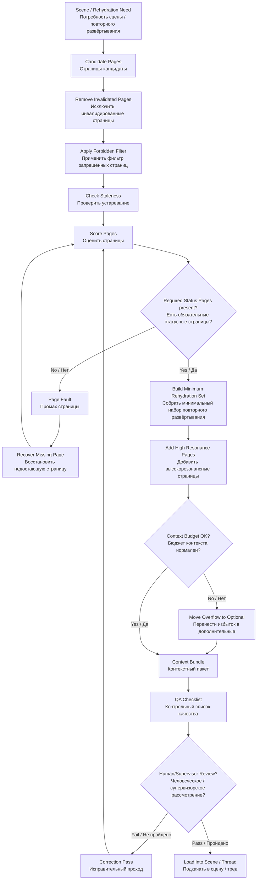

# ALL-IN-ONE — Context Paging Policy STCR
## Единый файл политики контекстной подкачки STCR

```yaml
artifact_id: CONTEXT-PAGING-POLICY-STCR-ALL-IN-ONE-2026-06-24-v0.1
status: candidate
canon_status: not_canon
```


---


# Context Paging Policy — STCR
## Политика контекстной подкачки для подсистемы смысловой свёртки треда и повторного развёртывания

```yaml
artifact_id: CONTEXT-PAGING-POLICY-STCR-2026-06-24-v0.1
artifact_type: context_paging_policy_candidate
status: candidate
canon_status: not_canon
project: IPaC_NIR_SEMANTIC_OS
parent_subsystem: Semantic Thread Compaction and Rehydration (смысловая свёртка треда и повторное развёртывание)
short_code: STCR_CPP
created: 2026-06-24
git_commit_authorized: false
human_approval_required_for_git_commit: true
```

---

# 0. Status Guard (статусный предохранитель)

Этот документ является **candidate (кандидат)** и **not canon (не канон)**.

Документ не является разрешением на Git commit (Git-проводку), promotion (повышение статуса), canonization (канонизацию) или автоматическое принятие решений без Human Approval (человеческого одобрения).

---

# 1. Назначение

Context Paging Policy (политика контекстной подкачки) задаёт правила выбора и подкачки Context Page (страниц контекста) из Associative Memory Subsystem (подсистемы ассоциативной памяти) в текущий Thread (тред), Scene (сцену), Rehydration Brief (бриф повторного развёртывания) или Agent Task Pack (агентный пакет задач).

Главная задача:

```text
подкачивать не всё релевантное,
а только то, что структурно усиливает текущую работу,
не разрушает Mainline (магистраль)
и не превращает новую Scene (сцену) в перегруженный Thread (тред).
```

---

# 2. Базовое различение

```text
Relevance (релевантность):
  фрагмент относится к теме.

Resonance (резонанс):
  фрагмент усиливает текущую смысловую ситуацию.

Structural Reinforcement (структурное усиление):
  фрагмент помогает удержать цель, статус, решение, ограничение,
  риск, следующий шаг или проверку.

Context Page (страница контекста):
  управляемая memory page (страница памяти) с происхождением,
  статусом, назначением, ограничениями и правилами подкачки.

Noise (шум):
  фрагмент может быть интересен, но сейчас перегружает сцену,
  сбивает Mainline (магистраль) или вносит ложный статус.
```

---

# 3. Что считается Context Page (страницей контекста)

Context Page (страница контекста) должна иметь минимальный набор:

```yaml
context_page_id:
title:
status: candidate / review / decision / canon
canon_status:
source_artifact:
source_thread:
provenance:
page_type:
semantic_payload:
required_for:
optional_for:
forbidden_when:
stale_after:
superseded_by:
confidence_level:
human_review_required:
git_commit_authorized: false
```

Без этих полей фрагмент является не Context Page (страницей контекста), а raw fragment (сырой фрагмент), который нельзя подкачивать как trusted context (доверенный контекст).

---

# 4. Классы страниц

```text
Required Page (обязательная страница):
  без неё Scene (сцена) или Rehydration (повторное развёртывание)
  не восстановит рабочую способность.

Optional Page (дополнительная страница):
  полезна, но не обязательна.

Support Page (поддерживающая страница):
  даёт пояснение, схему, исторический фон или пример.

Evidence Page (страница свидетельств):
  содержит LOG (журнал), QA (контроль качества), цитату, trace (трассу)
  или другой источник проверки.

Decision Page (страница решения):
  содержит Decision (решение) или decision candidate (кандидат решения).

Constraint Page (страница ограничений):
  содержит запреты, guard rails (ограждения), status guard
  (статусный предохранитель), Git policy (политику Git).

Forbidden Page (запрещённая страница):
  не должна подкачиваться в текущую Scene (сцену), даже если релевантна.
```

---

# 5. Page Selection Criteria (критерии выбора страниц)

Каждая candidate page (страница-кандидат) оценивается по семи измерениям:

```text
1. Relevance (релевантность):
   относится ли к текущей теме.

2. Resonance (резонанс):
   усиливает ли текущую смысловую ситуацию.

3. Structural Reinforcement (структурное усиление):
   помогает ли удержать цель, статус, ограничения, следующий шаг.

4. Risk (риск):
   может ли внести шум, ложный статус, старую ошибку или перегруз.

5. Freshness (свежесть):
   не устарела ли страница.

6. Status Integrity (целостность статуса):
   не смешивает ли factography (фактографию),
   interpretation (интерпретацию), decision (решение), canon (канон).

7. Payload Weight (вес полезной нагрузки):
   не слишком ли тяжёлая страница для текущей Scene (сцены).
```

---

# 6. Context Budget (бюджет контекста)

По умолчанию для нового Thread (треда), Scene (сцены) или Rehydration Brief (брифа повторного развёртывания):

```text
Minimum Set (минимальный набор):
  3–5 Context Pages (страниц контекста)

Normal Set (нормальный набор):
  5–9 Context Pages (страниц контекста)

Heavy Set (тяжёлый набор):
  10–15 Context Pages (страниц контекста)

Critical Limit (критический предел):
  15+ Context Pages (страниц контекста) требуют отдельного Supervisor Review
  (рассмотрения супервизором)
```

Правило:

```text
Лучше подкачать 5 точных страниц,
чем 25 частично релевантных.
```

---

# 7. Required / Optional / Forbidden Split (разделение обязательного, дополнительного и запрещённого)

Каждый Rehydration Brief (бриф повторного развёртывания) или Scene (сцена) должен содержать:

```yaml
context_pages:
  required:
    - page_id:
      reason:
      restores:
  optional:
    - page_id:
      reason:
      use_if:
  forbidden:
    - page_id:
      reason:
      risk:
```

Запрещённая страница не удаляется из памяти. Она только не подкачивается в текущую Scene (сцену).

---

# 8. Resonance Test (тест резонанса)

Страница считается resonant (резонансной), если она отвечает минимум на два вопроса:

```text
- Что она восстанавливает?
- Какой риск она снижает?
- Какую текущую задачу она ускоряет?
- Какой статус она уточняет?
- Какой next action (следующее действие) делает возможным?
- Какую ошибку предотвращает?
- Какой open debt (открытый долг) удерживает?
```

Если страница только “интересная”, но не проходит этот тест, она идёт в Optional Page (дополнительную страницу) или Parking Lot (парковку).

---

# 9. Page Fault Handling (обработка промаха страницы)

Page Fault (промах страницы) возникает, когда текущей Scene (сцене) не хватает контекста.

Признаки:

```text
- Supervisor (супервизор) теряет active focus (активный фокус);
- возникает повторный вопрос о уже зафиксированном статусе;
- появляется риск Status Collapse (схлопывания статусов);
- невозможно продолжить без source artifact (исходного артефакта);
- открытый долг был потерян;
- подкачана красивая, но недостаточная summary page (страница пересказа).
```

Response (реакция):

```text
1. остановить расширение Mainline (магистрали);
2. назвать missing page (недостающую страницу);
3. найти source artifact (исходный артефакт);
4. подкачать минимальный дополнительный контекст;
5. обновить Rehydration Brief (бриф повторного развёртывания);
6. зафиксировать Page Fault (промах страницы) в Daily Register (Дневном реестре).
```

---

# 10. Stale Page Policy (политика устаревших страниц)

Страница считается stale (устаревшей), если:

```text
- она superseded (заменена) более новым artifact (артефактом);
- её status (статус) изменился;
- она содержит ошибку, закрытую Correction Report (отчётом исправления);
- она была создана до важного Decision (решения), меняющего контекст;
- она противоречит текущему Process Regulation (процессному положению).
```

Stale Page (устаревшая страница) не удаляется. Она получает marker (маркер):

```yaml
page_status: stale
superseded_by:
use_policy: do_not_load_as_required
```

---

# 11. Conflict Resolution (разрешение конфликтов)

Если две Context Pages (страницы контекста) конфликтуют:

```text
1. Factography (фактография) сильнее interpretation (интерпретации).
2. Human Decision (человеческое решение) сильнее assistant inference
   (вывода ассистента).
3. Canon (канон) сильнее candidate (кандидата), но только если канон явно установлен.
4. Fresh reviewed artifact (свежий рассмотренный артефакт) сильнее старого raw note
   (сырой заметки).
5. Correction Report (отчёт исправления) сильнее исправляемого artifact (артефакта).
```

Если конфликт не разрешён, обе страницы подкачиваются как conflict pair (конфликтная пара) и требуют Human Architect Review (рассмотрения человеческим архитектором).

---

# 12. Cache Invalidation (инвалидация кэша)

Context Page (страница контекста) должна быть invalidated (инвалидирована), если обнаружены:

```text
- Memory Poisoning (отравление памяти);
- Canon Leakage (утечка в канон);
- Status Collapse (схлопывание статусов);
- False Resonance (ложный резонанс);
- outdated decision boundary (устаревшая граница решения);
- broken provenance (сломанное происхождение).
```

Invalidated Page (инвалидированная страница) не удаляется, а помечается:

```yaml
page_status: invalidated
reason:
invalidated_by:
do_not_page: true
replacement:
```

---

# 13. Minimum Rehydration Set (минимальный набор повторного развёртывания)

Для Clean Re-entry (чистого повторного входа) обязательны:

```text
1. Active Focus Page (страница активного фокуса).
2. Status Guard Page (страница статусного предохранителя).
3. Open Debts Page (страница открытых долгов).
4. Next Actions Page (страница следующих действий).
5. Prohibitions Page (страница запретов).
6. Evidence / Provenance Page (страница свидетельств / происхождения).
```

Для Scene (сцены) дополнительно:

```text
7. Scene Goal Page (страница цели сцены).
8. Role Brief Page (страница брифа ролей).
9. Verification Criteria Page (страница критериев проверки).
```

---

# 14. Relationship to Scene-based Agentic Work (связь со сценовой агентной работой)

В целевой среде Codex (Кодекс), Claude (Клод), Antigravity (АнтиГравити) и multi-agent interaction (мультиагентного взаимодействия) Context Paging (контекстная подкачка) должна подавать:

```text
- не весь прошлый Thread (тред);
- не весь Resource Pack (ресурсный пакет);
- не весь Obsidian Vault (хранилище Obsidian);

а точный Context Bundle (контекстный пакет):
  цель,
  роли,
  ограничения,
  обязательные страницы,
  запрещённый шум,
  критерии проверки,
  ожидаемый output (выход).
```

---

# 15. QA Checklist (контрольный список качества)

Перед использованием Context Bundle (контекстного пакета):

```text
[ ] Есть active focus (активный фокус).
[ ] Есть status guard (статусный предохранитель).
[ ] Есть required pages (обязательные страницы).
[ ] Optional pages (дополнительные страницы) не перегружают Scene (сцену).
[ ] Forbidden pages (запрещённые страницы) явно указаны.
[ ] Relevance (релевантность) не спутана с resonance (резонансом).
[ ] Нет stale required pages (устаревших обязательных страниц).
[ ] Нет invalidated pages (инвалидированных страниц).
[ ] Есть evidence / provenance (свидетельства / происхождение).
[ ] Git commit (Git-проводка) не разрешена без Human Approval (человеческого одобрения).
```

---

# 16. Next Integration (следующая интеграция)

Документ должен быть связан с:

```text
- Process Regulation (процессным положением);
- Failure Mode Register (реестром режимов отказа);
- Semantic Compaction Schema (схемой смысловой свёртки);
- Rehydration Acceptance Test (приёмочным тестом повторного развёртывания);
- Thread-to-Scene Transition Policy (политикой перехода от треда к сценам).
```


---


# Appendix A — Context Page Selection Algorithm
## Приложение A — алгоритм выбора страниц контекста

```yaml
artifact_id: APPENDIX-A-CONTEXT-PAGE-SELECTION-STCR-2026-06-24-v0.1
artifact_type: appendix_candidate / selection_algorithm
status: candidate
canon_status: not_canon
created: 2026-06-24
```

---

# 1. Назначение

Appendix A (Приложение A) задаёт практический алгоритм выбора Context Pages (страниц контекста) для Thread (треда), Scene (сцены), Rehydration Brief (брифа повторного развёртывания) или Agent Task Pack (агентного пакета задач).

---

# 2. Input (вход)

```yaml
current_scene:
  goal:
  active_focus:
  roles:
  expected_output:
  verification:
  forbidden_noise:

candidate_pages:
  - page_id:
    title:
    page_type:
    status:
    provenance:
    relevance:
    resonance:
    risk:
    freshness:
    weight:
```

---

# 3. Scoring Model (модель оценки)

Каждая page (страница) получает оценку:

```text
Relevance Score (оценка релевантности): 0–3
Resonance Score (оценка резонанса): 0–3
Structural Reinforcement Score (оценка структурного усиления): 0–3
Risk Penalty (штраф риска): 0–3
Staleness Penalty (штраф устаревания): 0–3
Weight Penalty (штраф веса): 0–2
```

Рабочая формула-кандидат:

```text
Paging Priority (приоритет подкачки)
=
Relevance (релевантность)
+ Resonance (резонанс)
+ Structural Reinforcement (структурное усиление)
- Risk (риск)
- Staleness (устаревание)
- Weight (вес)
```

Статус формулы: candidate heuristic (эвристика-кандидат), not canon (не канон).

---

# 4. Selection Steps (шаги выбора)

```text
1. Remove invalidated pages (удалить из отбора инвалидированные страницы).
2. Remove forbidden pages (удалить из отбора запрещённые страницы).
3. Mark stale pages (пометить устаревшие страницы).
4. Score remaining pages (оценить оставшиеся страницы).
5. Select mandatory status pages (выбрать обязательные статусные страницы).
6. Select minimum rehydration set (выбрать минимальный набор повторного развёртывания).
7. Add high resonance pages (добавить высокорезонансные страницы).
8. Check context budget (проверить бюджет контекста).
9. Move overflow to optional pages (перенести избыток в дополнительные страницы).
10. Produce Context Bundle (сформировать контекстный пакет).
```

---

# 5. Output (выход)

```yaml
context_bundle_id:
status: candidate
canon_status: not_canon
for_scene:
required_pages:
  - page_id:
    reason:
    restores:
optional_pages:
  - page_id:
    reason:
    use_if:
forbidden_pages:
  - page_id:
    reason:
page_fault_watch:
  - missing_signal:
    recovery_action:
qa_check:
  status_guard: true
  provenance_present: true
  no_invalidated_pages: true
  human_review_required: true
```

---

# 6. Supervisor Decision Points (точки решения супервизора)

Supervisor (супервизор) обязан остановить подкачку, если:

```text
- required pages (обязательные страницы) больше 9 без причины;
- forbidden pages (запрещённые страницы) не указаны;
- нет provenance (происхождения);
- есть conflict pair (конфликтная пара);
- page priority (приоритет страницы) высокий только за счёт relevance (релевантности),
  но без resonance (резонанса);
- Context Bundle (контекстный пакет) может вызвать Overpaging (избыточную подкачку).
```


---

# Mermaid Scheme (Mermaid-схема)



---


# QA Review — Context Paging Policy STCR
## Отчёт контроля качества политики контекстной подкачки STCR

```yaml
artifact_id: QA-CONTEXT-PAGING-POLICY-STCR-2026-06-24-v0.1
artifact_type: qa_review
status: candidate
canon_status: not_canon
created: 2026-06-24
```

---

# 1. Checks (проверки)

```text
[PASS] Context Paging Policy (политика контекстной подкачки) создана.
[PASS] Relevance (релевантность) отделена от Resonance (резонанса).
[PASS] Structural Reinforcement (структурное усиление) введено как критерий.
[PASS] Required / Optional / Forbidden Pages
       (обязательные / дополнительные / запрещённые страницы) определены.
[PASS] Context Budget (бюджет контекста) задан.
[PASS] Page Fault Handling (обработка промаха страницы) задана.
[PASS] Stale Page Policy (политика устаревших страниц) задана.
[PASS] Cache Invalidation (инвалидация кэша) задана.
[PASS] Minimum Rehydration Set (минимальный набор повторного развёртывания) задан.
[PASS] Scene-based Agentic Work (сценовая агентная работа) учтена.
[PASS] Status candidate (кандидат), not_canon (не канон) удержан.
[PASS] Git commit (Git-проводка) не авторизована.
```

---

# 2. Open Debts (открытые долги)

```text
- Human Visual Verification (человеческая визуальная проверка);
- первый практический Context Bundle (контекстный пакет);
- связь с Semantic Compaction Schema (схемой смысловой свёртки);
- связь с Rehydration Acceptance Test (приёмочным тестом повторного развёртывания);
- будущий Context Page Selector Dry Run (сухой запуск выбора страниц контекста).
```

---

# 3. QA Status (статус контроля качества)

```text
QA_STATUS:
  GREEN_WITH_OPEN_DEBTS

RESOURCE_READINESS:
  ready_for_candidate_placement

CANON_READINESS:
  no

COMMIT_READINESS:
  not_yet
```


---


# Routing Map — Context Paging Policy STCR
## Карта размещения политики контекстной подкачки STCR

```yaml
artifact_id: ROUTING-MAP-CONTEXT-PAGING-POLICY-STCR-2026-06-24-v0.1
artifact_type: routing_map
status: candidate
canon_status: not_canon
created: 2026-06-24
```

---

# Primary placement (основное размещение)

```text
11_COS_ARCHITECTURE_PROJECT_DECISIONS/04_PROCESS_DECISIONS/
  CONTEXT_PAGING_POLICY_STCR_candidate_v0_1.md
  APPENDIX_A_CONTEXT_PAGE_SELECTION_STCR_candidate_v0_1.md
  STCR_CONTEXT_PAGING_POLICY_v0_1.mmd
```

---

# Review placement (размещение рассмотрения)

```text
08_TRACE_AND_DECISIONS/reviews/
  QA_CONTEXT_PAGING_POLICY_STCR_2026-06-24_v0_1.md
```

---

# Resource package placement (размещение ресурсного пакета)

```text
09_SOURCE_PACKAGES/stcr_context_paging_policy/
  README_CONTEXT_PAGING_POLICY_STCR_PACKAGE_v0_1.md
  RESOURCE_ENTRY_CONTEXT_PAGING_POLICY_STCR_2026-06-24_v0_1.md
  ROUTING_MAP_CONTEXT_PAGING_POLICY_STCR_2026-06-24_v0_1.md
  CONTEXT_PAGING_POLICY_STCR_ALL_IN_ONE_2026-06-24_v0_1.md
  MANIFEST_CONTEXT_PAGING_POLICY_STCR_PACKAGE_2026-06-24_v0_1.md
  SHA256SUMS_STCR_CPP_v0_1.txt
```

---

# Script placement (размещение скрипта)

```text
09_SOURCE_PACKAGES/scripts/
  PLACE_STCR_CONTEXT_PAGING_POLICY_TO_VAULT_v0_1.ps1
```

---

# Git Policy (политика Git)

```text
No git add . (никакого широкого Git-добавления).
Targeted Git add (точечное Git-добавление) только после Human Approval (человеческого одобрения).
Git commit (Git-проводка) не разрешена этим пакетом.
```


---


# Resource Entry — Context Paging Policy STCR
## Ресурсная запись политики контекстной подкачки STCR

```yaml
resource_object_name: IPAC_CONTEXT_PAGING_POLICY_STCR_PACKAGE_2026-06-24_v0_1
status: candidate
canon_status: not_canon
resource_type: context_paging_policy_package
project: IPaC_NIR_SEMANTIC_OS
created: 2026-06-24
main_file: CONTEXT_PAGING_POLICY_STCR_candidate_v0_1.md
all_in_one_file: CONTEXT_PAGING_POLICY_STCR_ALL_IN_ONE_2026-06-24_v0_1.md
short_code: STCR_CPP
git_commit_authorized: false
human_approval_required_for_git_commit: true
```

---

# Назначение

Resource Entry (ресурсная запись) описывает Context Paging Policy (политику контекстной подкачки) для подсистемы Semantic Thread Compaction and Rehydration (смысловой свёртки треда и повторного развёртывания).

---

# Использовать когда

```text
- нужно открыть новый Thread (тред) через Rehydration Brief (бриф повторного развёртывания);
- нужно собрать Scene (сцену);
- нужно подготовить Agent Task Pack (агентный пакет задач);
- есть риск Overpaging (избыточной подкачки);
- есть риск Underpaging (недоподкачки);
- нужно отличить resonance (резонанс) от relevance (релевантности).
```
