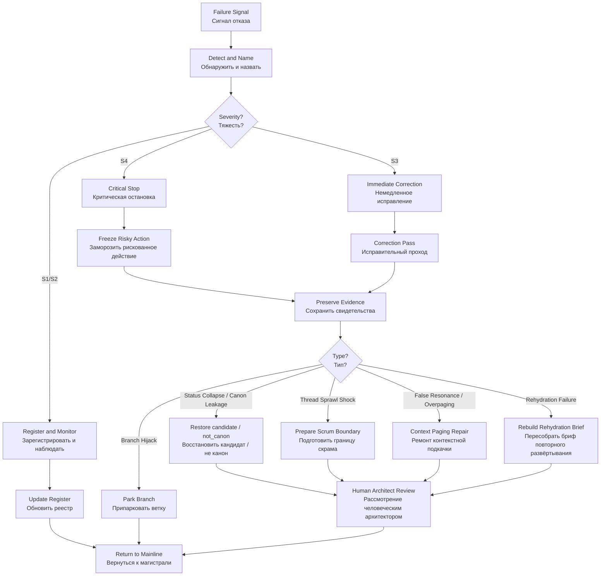

# ALL-IN-ONE — Failure Mode Register STCR
## Единый файл реестра режимов отказа STCR

```yaml
artifact_id: FAILURE-MODE-REGISTER-STCR-ALL-IN-ONE-2026-06-24-v0.1
status: candidate
canon_status: not_canon
```


---


# Failure Mode Register — Semantic Thread Compaction and Rehydration
## Реестр режимов отказа подсистемы смысловой свёртки треда и повторного развёртывания

```yaml
artifact_id: FAILURE-MODE-REGISTER-STCR-2026-06-24-v0.1
artifact_type: failure_mode_register_candidate
status: candidate
canon_status: not_canon
project: IPaC_NIR_SEMANTIC_OS
parent_subsystem: Semantic Thread Compaction and Rehydration (смысловая свёртка треда и повторное развёртывание)
parent_process_regulation: PROCESS_REGULATION_SEMANTIC_THREAD_COMPACTION_REHYDRATION_candidate_v0_1.md
created: 2026-06-24
git_commit_authorized: false
human_approval_required_for_git_commit: true
```

---

# 0. Status Guard (статусный предохранитель)

Этот документ является **candidate (кандидат)** и **not canon (не канон)**.

Документ не является разрешением на Git commit (Git-проводку), promotion (повышение статуса), canonization (канонизацию) или изменение правил проекта без Human Approval (человеческого одобрения).

---

# 1. Назначение

Failure Mode Register (реестр режимов отказа) фиксирует, где может сломаться процесс:

```text
Thread (тред)
→ Semantic Compaction (смысловая свёртка)
→ Alienation (отчуждение)
→ Associative Memory Placement (размещение в ассоциативной памяти)
→ Virtual Context Paging (виртуальная контекстная подкачка)
→ Rehydration (повторное развёртывание)
→ Scene-based Agentic Work (сценовая агентная работа)
```

Цель документа — не драматизировать проблему, а сделать отказ видимым, диагностируемым и исправляемым.

---

# 2. Scope (область действия)

Реестр применяется к:

```text
- длинным Browser Thread (браузерным тредам);
- Day Closeout (закрытию дня);
- Scrum Boundary (границе скрама);
- Thread Cut (отсечению треда);
- Semantic Compaction (смысловой свёртке);
- Resource Pack (ресурсному пакету);
- Context Page (странице контекста);
- Scene (сцене);
- Agent Task Pack (агентному пакету задач);
- Rehydration Brief (брифу повторного развёртывания).
```

---

# 3. Failure Mode Scale (шкала режимов отказа)

```text
Severity (тяжесть):
  S1 — low (низкая): локальный шум, не ломает процесс.
  S2 — medium (средняя): требует исправления, но работа продолжается.
  S3 — high (высокая): угрожает потере управляемости.
  S4 — critical (критическая): требует остановки, свёртки или отката.

Likelihood (вероятность):
  L1 — rare (редко)
  L2 — possible (возможно)
  L3 — likely (вероятно)
  L4 — recurring (повторяется)

Detection (обнаруживаемость):
  D1 — easy (легко)
  D2 — moderate (средне)
  D3 — hard (трудно)
  D4 — hidden (скрыто)
```

---

# 4. Register (реестр)

## FM-01 — Summary Drift (дрейф в краткий пересказ)

```yaml
failure_mode_id: FM-01
name: Summary Drift (дрейф в краткий пересказ)
severity: S3
likelihood: L3
detection: D2
```

Описание: Semantic Compaction (смысловая свёртка) деградирует в обычный summary (краткий пересказ), теряя factography (фактографию), decisions (решения), open debts (открытые долги), status boundaries (границы статуса), provenance (происхождение) и next actions (следующие действия).

Early signals (ранние признаки):

```text
- текст стал красивым, но неоперационным;
- не указано, что делать дальше;
- исчезли статусы candidate (кандидат) / not_canon (не канон);
- нет source artifacts (исходных артефактов);
- нет open debts (открытых долгов).
```

Mitigation (смягчение):

```text
- использовать Semantic Compaction Schema (схему смысловой свёртки);
- требовать factography / interpretation / decision / canon separation
  (разделение фактографии / интерпретации / решения / канона);
- добавлять QA Review (отчёт контроля качества).
```

Recovery (восстановление):

```text
- пометить свёртку как failed_candidate (неудачный кандидат);
- вернуться к source Thread (исходному треду) или preserved thread text
  (сохранённой текстовке треда);
- выполнить Correction Pass (исправительный проход).
```

---

## FM-02 — Status Collapse (схлопывание статусов)

```yaml
failure_mode_id: FM-02
name: Status Collapse (схлопывание статусов)
severity: S4
likelihood: L3
detection: D2
```

Описание: factography (фактография), interpretation (интерпретация), decision (решение), candidate (кандидат) и canon (канон) смешиваются.

Early signals (ранние признаки):

```text
- консультантское advisory_review (рекомендательное рассмотрение)
  начинает звучать как decision (решение);
- candidate Rule (правило-кандидат) воспринимается как canon Rule
  (каноническое правило);
- исчезает Human Approval Gate (шлюз человеческого одобрения).
```

Mitigation (смягчение):

```text
- каждый artifact (артефакт) содержит status block (блок статуса);
- любое повышение статуса требует Human Decision (человеческого решения);
- Git commit (Git-проводка) не выполняется автоматически.
```

Recovery (восстановление):

```text
- выпустить Errata (исправление);
- вернуть статус candidate (кандидат), not_canon (не канон);
- зафиксировать инцидент в QA Review (отчёте контроля качества).
```

---

## FM-03 — Canon Leakage (утечка в канон)

```yaml
failure_mode_id: FM-03
name: Canon Leakage (утечка в канон)
severity: S4
likelihood: L2
detection: D3
```

Описание: рабочий candidate (кандидат) незаметно начинает использоваться как canon (канон).

Mitigation (смягчение):

```text
- status guard (статусный предохранитель) в каждом документе;
- отдельный Canonization Gate (шлюз канонизации);
- запрет promotion (повышения статуса) изнутри самого artifact (артефакта).
```

Recovery (восстановление):

```text
- создать Correction Report (отчёт исправления);
- отметить документ as_not_canon (как не канон);
- запросить Human Architect Review (рассмотрение человеческим архитектором).
```

---

## FM-04 — Missing Provenance (потеря происхождения)

```yaml
failure_mode_id: FM-04
name: Missing Provenance (потеря происхождения)
severity: S3
likelihood: L3
detection: D3
```

Описание: artifact (артефакт) есть, но непонятно, из какого Thread (треда), решения, LOG (журнала), review (рассмотрения) или source pack (исходного пакета) он произошёл.

Mitigation (смягчение):

```text
- обязательный provenance block (блок происхождения);
- MANIFEST (манифест);
- Resource Entry (ресурсная запись);
- Evidence Index (индекс свидетельств).
```

Recovery (восстановление):

```text
- создать Backtrace Note (заметку обратной трассировки);
- связать artifact (артефакт) с source Thread (исходным тредом);
- обновить Resource Entry (ресурсную запись).
```

---

## FM-05 — False Resonance (ложный резонанс)

```yaml
failure_mode_id: FM-05
name: False Resonance (ложный резонанс)
severity: S3
likelihood: L3
detection: D3
```

Описание: Context Paging (контекстная подкачка) выбирает яркий, но не нужный fragment (фрагмент), потому что он эмоционально или концептуально силён, но не усиливает текущую Scene (сцену).

Mitigation (смягчение):

```text
- Context Paging Policy (политика контекстной подкачки);
- различать relevance (релевантность), resonance (резонанс)
  и structural reinforcement (структурное усиление);
- фиксировать forbidden noise (запрещённый шум).
```

Recovery (восстановление):

```text
- удалить fragment (фрагмент) из required context pages
  (обязательных страниц контекста);
- перенести его в optional pages (дополнительные страницы)
  или Parking Lot (парковку);
- выполнить Rehydration Check (проверку повторного развёртывания).
```

---

## FM-06 — Overpaging (избыточная подкачка)

```yaml
failure_mode_id: FM-06
name: Overpaging (избыточная подкачка)
severity: S3
likelihood: L4
detection: D2
```

Описание: в новый Thread (тред) или Scene (сцену) подкачивается слишком много context pages (страниц контекста), и новая среда быстро становится такой же тяжёлой, как старая.

Mitigation (смягчение):

```text
- context budget (бюджет контекста);
- required / optional / forbidden page classes
  (классы обязательных / дополнительных / запрещённых страниц);
- minimum rehydration set (минимальный набор повторного развёртывания).
```

Recovery (восстановление):

```text
- сократить подкачку до mandatory pages (обязательных страниц);
- вынести остальное в parked context (припаркованный контекст);
- повторить Clean Re-entry (чистый повторный вход).
```

---

## FM-07 — Underpaging (недоподкачка)

```yaml
failure_mode_id: FM-07
name: Underpaging (недоподкачка)
severity: S3
likelihood: L3
detection: D3
```

Описание: в новый Thread (тред) или Scene (сцену) подкачан красивый итог, но не подкачаны необходимые evidence (свидетельства), decision boundaries (границы решений), open debts (открытые долги) или constraints (ограничения).

Mitigation (смягчение):

```text
- Rehydration Acceptance Test (приёмочный тест повторного развёртывания);
- обязательный active focus (активный фокус);
- обязательные open debts (открытые долги);
- обязательные prohibitions (запреты).
```

Recovery (восстановление):

```text
- выполнить Page Fault Recovery (восстановление при промахе страницы);
- подкачать недостающие pages (страницы);
- обновить Rehydration Brief (бриф повторного развёртывания).
```

---

## FM-08 — Orphan Artifact (осиротевший артефакт)

```yaml
failure_mode_id: FM-08
name: Orphan Artifact (осиротевший артефакт)
severity: S2
likelihood: L3
detection: D2
```

Описание: artifact (артефакт) создан, но не имеет Resource Entry (ресурсной записи), MANIFEST (манифеста), routing path (маршрута размещения) или связи с register (реестром).

Mitigation (смягчение):

```text
- каждый package (пакет) содержит Routing Map (карту маршрутизации);
- каждый artifact (артефакт) получает Resource Entry (ресурсную запись);
- placement script (скрипт размещения) возвращает Git status (статус Git).
```

Recovery (восстановление):

```text
- создать Resource Entry (ресурсную запись);
- добавить Routing Map (карту маршрутизации);
- переместить artifact (артефакт) в правильный register (реестр).
```

---

## FM-09 — Git Limbo (подвешенность Git)

```yaml
failure_mode_id: FM-09
name: Git Limbo (подвешенность Git)
severity: S2
likelihood: L4
detection: D1
```

Описание: artifact (артефакт) размещён в Obsidian Vault (хранилище Obsidian), но долго остаётся untracked (неотслеживаемым) или unstaged (неподготовленным).

Mitigation (смягчение):

```text
- отдельный Uncommitted Candidate Register
  (реестр непроведённых кандидатов);
- targeted Git add (точечное Git-добавление);
- запрет git add . (широкого Git-добавления).
```

Recovery (восстановление):

```text
- выполнить targeted Git status (точечный статус Git);
- принять Human Decision (человеческое решение):
  оставить untracked (неотслеживаемым), добавить в Git (Git)
  или удалить.
```

---

## FM-10 — Rehydration Failure (сбой повторного развёртывания)

```yaml
failure_mode_id: FM-10
name: Rehydration Failure (сбой повторного развёртывания)
severity: S4
likelihood: L2
detection: D2
```

Описание: новый Thread (тред) или Scene (сцена) не восстанавливает working semantic capability (рабочую смысловую способность): потерян focus (фокус), open debts (открытые долги), next action (следующее действие) или status boundaries (границы статуса).

Mitigation (смягчение):

```text
- Rehydration Acceptance Test (приёмочный тест повторного развёртывания);
- minimum rehydration set (минимальный набор повторного развёртывания);
- preserved thread closeout (сохранённое закрытие треда).
```

Recovery (восстановление):

```text
- остановить continuation (продолжение);
- выполнить context page audit (аудит страниц контекста);
- повторить Rehydration Brief (бриф повторного развёртывания).
```

---

## FM-11 — Memory Poisoning (отравление памяти)

```yaml
failure_mode_id: FM-11
name: Memory Poisoning (отравление памяти)
severity: S4
likelihood: L2
detection: D4
```

Описание: ошибочный compacted object (свёрнутый объект) попадает в Associative Memory Subsystem (подсистему ассоциативной памяти) и затем подкачивается как доверенный context (контекст).

Mitigation (смягчение):

```text
- confidence level (уровень уверенности);
- evidence quality (качество свидетельств);
- invalidation marker (маркер недействительности);
- correction log (журнал исправлений).
```

Recovery (восстановление):

```text
- пометить memory page (страницу памяти) как invalidated (инвалидированную);
- выпустить Correction Report (отчёт исправления);
- найти все dependent pages (зависимые страницы).
```

---

## FM-12 — Human Approval Ambiguity (неясность человеческого одобрения)

```yaml
failure_mode_id: FM-12
name: Human Approval Ambiguity (неясность человеческого одобрения)
severity: S3
likelihood: L3
detection: D2
```

Описание: непонятно, что именно Human Architect (человеческий архитектор) одобрил: текст, placement (размещение), Git add (Git-добавление), Git commit (Git-проводку), promotion (повышение статуса) или canonization (канонизацию).

Mitigation (смягчение):

```text
- разделять approval types (типы одобрения);
- явно спрашивать перед Git add (Git-добавлением);
- отдельно спрашивать перед Git commit (Git-проводкой);
- canonization (канонизация) только отдельным decision (решением).
```

Recovery (восстановление):

```text
- остановить действие;
- запросить explicit approval (явное одобрение);
- оформить Decision Note (заметку решения).
```

---

## FM-13 — Day Closeout Misread as Thread Cut (ошибочное понимание закрытия дня как отсечения треда)

```yaml
failure_mode_id: FM-13
name: Day Closeout Misread as Thread Cut (ошибочное понимание закрытия дня как отсечения треда)
severity: S3
likelihood: L2
detection: D1
```

Описание: ежедневный Day Closeout (закрытие дня) ошибочно трактуется как требование ежедневно закрывать Thread (тред).

Mitigation (смягчение):

```text
- формула: Day Closeout (закрытие дня) ≠ Thread Cut (отсечение треда);
- Thread Cut (отсечение треда) выполняется по Scrum Boundary
  (границе скрама) или crisis trigger (кризисному триггеру);
- Day Closeout (закрытие дня) фиксирует resonance points
  (резонансные точки), но не обрубает рабочую сцену.
```

Recovery (восстановление):

```text
- выпустить Errata (исправление);
- вернуть Thread (тред) в active working mode (активный рабочий режим);
- обновить Process Regulation (процессное положение).
```

---

## FM-14 — Thread Sprawl Shock (шок разрастания треда)

```yaml
failure_mode_id: FM-14
name: Thread Sprawl Shock (шок разрастания треда)
severity: S4
likelihood: L3
detection: D2
```

Описание: Thread (тред) долго работает быстро, затем внезапно достигает зоны деградации: торможение, потеря управляемости, невозможность бросить незавершённый материал.

Metric (метрика):

```text
PDF Page Count (счёт страниц PDF-документа):
  0–700 pages (страниц): working zone (рабочая зона)
  700–1200 pages (страниц): attention zone (зона внимания)
  1200–2000 pages (страниц): preparation zone (зона подготовки)
  2000+ pages (страниц): crisis zone (кризисная зона)
```

Mitigation (смягчение):

```text
- daily resonance register (ежедневный реестр резонансов);
- thread health check (проверка здоровья треда);
- pre-scrum compaction preparation (предварительная подготовка свёртки скрама);
- context page extraction (извлечение страниц контекста).
```

Recovery (восстановление):

```text
- остановить расширение Mainline (магистрали);
- выполнить Semantic Compaction (смысловую свёртку);
- закрыть Scrum Boundary (границу скрама), если нужно;
- открыть новый Thread (тред) через Rehydration Brief
  (бриф повторного развёртывания).
```

---

## FM-15 — Branch Hijack (захват магистрали боковой веткой)

```yaml
failure_mode_id: FM-15
name: Branch Hijack (захват магистрали боковой веткой)
severity: S3
likelihood: L4
detection: D1
```

Описание: интересная Branch (ветка) перехватывает Mainline (магистраль), и целевая тема теряется.

Mitigation (смягчение):

```text
- Dialogue Branch Parking Rule (правило парковки ветвей диалога);
- формула Mainline First, Branches Parked
  (сначала магистраль, ветки паркуются);
- Branch Detected block (блок обнаружения ветки).
```

Recovery (восстановление):

```text
- назвать Branch (ветку);
- вынести в Parking Lot (парковку);
- вернуться к Mainline (магистрали);
- добавить Branch (ветку) в Daily Register (Дневной реестр).
```

---

## FM-16 — Scene Prematurity (преждевременная сцена)

```yaml
failure_mode_id: FM-16
name: Scene Prematurity (преждевременная сцена)
severity: S3
likelihood: L3
detection: D2
```

Описание: фрагмент слишком рано оформляется как Scene (сцена), хотя ещё не имеет цели, ролей, context pages (страниц контекста), output (выхода) и verification (проверки).

Mitigation (смягчение):

```text
- Scene Object Template (шаблон объекта сцены);
- Thread-to-Scene Transition Policy (политика перехода от треда к сценам);
- Scene Candidate (кандидат сцены), а не finished Scene (готовая сцена).
```

Recovery (восстановление):

```text
- понизить статус до Scene Candidate (кандидат сцены);
- отправить в Parking Lot (парковку) или Backlog (бэклог);
- запросить missing context pages (недостающие страницы контекста).
```

---

# 5. Priority Response Matrix (матрица приоритетного реагирования)

```text
Critical stop (критическая остановка):
  FM-02 Status Collapse (схлопывание статусов)
  FM-03 Canon Leakage (утечка в канон)
  FM-10 Rehydration Failure (сбой повторного развёртывания)
  FM-11 Memory Poisoning (отравление памяти)
  FM-14 Thread Sprawl Shock (шок разрастания треда)

Immediate correction (немедленное исправление):
  FM-01 Summary Drift (дрейф в краткий пересказ)
  FM-05 False Resonance (ложный резонанс)
  FM-06 Overpaging (избыточная подкачка)
  FM-07 Underpaging (недоподкачка)
  FM-12 Human Approval Ambiguity (неясность человеческого одобрения)
  FM-13 Day Closeout Misread as Thread Cut
  (ошибочное понимание закрытия дня как отсечения треда)
  FM-15 Branch Hijack (захват магистрали боковой веткой)

Register and monitor (зарегистрировать и наблюдать):
  FM-04 Missing Provenance (потеря происхождения)
  FM-08 Orphan Artifact (осиротевший артефакт)
  FM-09 Git Limbo (подвешенность Git)
  FM-16 Scene Prematurity (преждевременная сцена)
```

---

# 6. Next Integration (следующая интеграция)

Этот Failure Mode Register (реестр режимов отказа) должен быть связан с:

```text
- Process Regulation (процессным положением);
- Context Paging Policy (политикой контекстной подкачки);
- Semantic Compaction Schema (схемой смысловой свёртки);
- Rehydration Acceptance Test (приёмочным тестом повторного развёртывания);
- Thread-to-Scene Transition Policy (политикой перехода от треда к сценам).
```


---


# Appendix A — Failure Mode Response Playbook
## Приложение A — сценарии реагирования на режимы отказа

```yaml
artifact_id: APPENDIX-A-FAILURE-MODE-RESPONSE-PLAYBOOK-STCR-2026-06-24-v0.1
artifact_type: appendix_candidate / response_playbook
status: candidate
canon_status: not_canon
created: 2026-06-24
```

---

# 1. Назначение

Playbook (сценарий реагирования) задаёт практические команды Supervisor (супервизора) при обнаружении failure mode (режима отказа).

---

# 2. Universal Response Loop (универсальный контур реагирования)

```text
1. Detect (обнаружить)
2. Name (назвать)
3. Classify (классифицировать)
4. Freeze risky action (заморозить рискованное действие)
5. Preserve evidence (сохранить свидетельства)
6. Correct or rollback (исправить или откатить)
7. Update register (обновить реестр)
8. Return to Mainline (вернуться к магистрали)
```

---

# 3. Emergency Commands (аварийные команды)

```text
STATUS_COLLAPSE_DETECTED:
  Stop promotion (остановить повышение статуса).
  Restore candidate (кандидат) / not_canon (не канон).
  Request Human Architect Review (рассмотрение человеческим архитектором).

THREAD_SPRAWL_SHOCK_DETECTED:
  Stop branch expansion (остановить разворачивание веток).
  Capture resonance points (зафиксировать резонансные точки).
  Prepare Scrum Boundary (подготовить границу скрама).
  Create Rehydration Brief (создать бриф повторного развёртывания).

BRANCH_HIJACK_DETECTED:
  Name Branch (назвать ветку).
  Park Branch (припарковать ветку).
  Return to Mainline (вернуться к магистрали).

FALSE_RESONANCE_DETECTED:
  Demote page from required to optional (понизить страницу из обязательной в дополнительную).
  Add forbidden noise marker (добавить маркер запрещённого шума).
  Re-run Context Paging Check (повторить проверку контекстной подкачки).

REHYDRATION_FAILURE_DETECTED:
  Stop continuation (остановить продолжение).
  Audit required pages (проверить обязательные страницы).
  Rebuild Rehydration Brief (пересобрать бриф повторного развёртывания).
```

---

# 4. Human Approval Boundaries (границы человеческого одобрения)

```text
Approval to place (одобрение размещения)
  не равно approval to Git add (одобрению Git-добавления).

Approval to Git add (одобрение Git-добавления)
  не равно approval to Git commit (одобрению Git-проводки).

Approval to use as candidate (одобрение использования как кандидата)
  не равно canonization (канонизации).

Canonization (канонизация)
  только отдельным Human Decision (человеческим решением).
```


---

# Mermaid Scheme (Mermaid-схема)



---


# QA Review — Failure Mode Register STCR
## Отчёт контроля качества реестра режимов отказа STCR

```yaml
artifact_id: QA-FAILURE-MODE-REGISTER-STCR-2026-06-24-v0.1
artifact_type: qa_review
status: candidate
canon_status: not_canon
created: 2026-06-24
```

---

# 1. Checks (проверки)

```text
[PASS] Failure Mode Register (реестр режимов отказа) создан.
[PASS] 16 failure modes (режимов отказа) перечислены.
[PASS] Summary Drift (дрейф в краткий пересказ) включён.
[PASS] Status Collapse (схлопывание статусов) включён.
[PASS] Canon Leakage (утечка в канон) включена.
[PASS] False Resonance (ложный резонанс) включён.
[PASS] Overpaging / Underpaging (избыточная / недостаточная подкачка) включены.
[PASS] Thread Sprawl Shock (шок разрастания треда) включён.
[PASS] Day Closeout Misread as Thread Cut
       (ошибочное понимание закрытия дня как отсечения треда) включён.
[PASS] Branch Hijack (захват магистрали боковой веткой) включён.
[PASS] Scene Prematurity (преждевременная сцена) включена.
[PASS] Status candidate (кандидат), not_canon (не канон) удержан.
[PASS] Git commit (Git-проводка) не авторизована.
```

---

# 2. Open Debts (открытые долги)

```text
- Human Visual Verification (человеческая визуальная проверка);
- связать с Context Paging Policy (политикой контекстной подкачки);
- связать с Rehydration Acceptance Test (приёмочным тестом повторного развёртывания);
- проверить применимость на первом реальном инциденте;
- не выполнять Git commit (Git-проводку) без Human Approval (человеческого одобрения).
```

---

# 3. QA Status (статус контроля качества)

```text
QA_STATUS:
  GREEN_WITH_OPEN_DEBTS

RESOURCE_READINESS:
  ready_for_candidate_placement

CANON_READINESS:
  no

COMMIT_READINESS:
  not_yet
```


---


# Routing Map — Failure Mode Register STCR
## Карта размещения реестра режимов отказа STCR

```yaml
artifact_id: ROUTING-MAP-FAILURE-MODE-REGISTER-STCR-2026-06-24-v0.1
artifact_type: routing_map
status: candidate
canon_status: not_canon
created: 2026-06-24
```

---

# Primary placement (основное размещение)

```text
11_COS_ARCHITECTURE_PROJECT_DECISIONS/04_PROCESS_DECISIONS/
  FAILURE_MODE_REGISTER_SEMANTIC_THREAD_COMPACTION_REHYDRATION_candidate_v0_1.md
  APPENDIX_A_FAILURE_MODE_RESPONSE_PLAYBOOK_STCR_candidate_v0_1.md
  SEMANTIC_THREAD_COMPACTION_REHYDRATION_FAILURE_MODES_v0_1.mmd
```

---

# Review placement (размещение рассмотрения)

```text
08_TRACE_AND_DECISIONS/reviews/
  QA_FAILURE_MODE_REGISTER_STCR_2026-06-24_v0_1.md
```

---

# Resource package placement (размещение ресурсного пакета)

```text
09_SOURCE_PACKAGES/stcr_failure_mode_register/
  README_FAILURE_MODE_REGISTER_STCR_PACKAGE_v0_1.md
  RESOURCE_ENTRY_FAILURE_MODE_REGISTER_STCR_2026-06-24_v0_1.md
  ROUTING_MAP_FAILURE_MODE_REGISTER_STCR_2026-06-24_v0_1.md
  FAILURE_MODE_REGISTER_STCR_ALL_IN_ONE_2026-06-24_v0_1.md
  MANIFEST_FAILURE_MODE_REGISTER_STCR_PACKAGE_2026-06-24_v0_1.md
  SHA256SUMS_STCR_FMR_v0_1.txt
```

---

# Script placement (размещение скрипта)

```text
09_SOURCE_PACKAGES/scripts/
  PLACE_STCR_FAILURE_MODE_REGISTER_TO_VAULT_v0_1.ps1
```

---

# Git Policy (политика Git)

```text
No git add . (никакого широкого Git-добавления).
Targeted Git add (точечное Git-добавление) только после Human Approval (человеческого одобрения).
Git commit (Git-проводка) не разрешена этим пакетом.
```


---


# Resource Entry — Failure Mode Register STCR
## Ресурсная запись реестра режимов отказа STCR

```yaml
resource_object_name: IPAC_FAILURE_MODE_REGISTER_STCR_PACKAGE_2026-06-24_v0_1
status: candidate
canon_status: not_canon
resource_type: failure_mode_register_package
project: IPaC_NIR_SEMANTIC_OS
created: 2026-06-24
main_file: FAILURE_MODE_REGISTER_SEMANTIC_THREAD_COMPACTION_REHYDRATION_candidate_v0_1.md
all_in_one_file: FAILURE_MODE_REGISTER_STCR_ALL_IN_ONE_2026-06-24_v0_1.md
git_commit_authorized: false
human_approval_required_for_git_commit: true
```

---

# Назначение

Resource Entry (ресурсная запись) описывает Failure Mode Register (реестр режимов отказа) для подсистемы Semantic Thread Compaction and Rehydration (смысловой свёртки треда и повторного развёртывания).

---

# Использовать когда

```text
- появляется риск Summary Drift (дрейфа в краткий пересказ);
- смешиваются статусы candidate (кандидат), decision (решение), canon (канон);
- Thread (тред) резко тормозится после накопления;
- Context Paging (контекстная подкачка) подкачивает слишком много или слишком мало;
- Rehydration (повторное развёртывание) не восстанавливает рабочую способность;
- боковая Branch (ветка) захватывает Mainline (магистраль).
```
