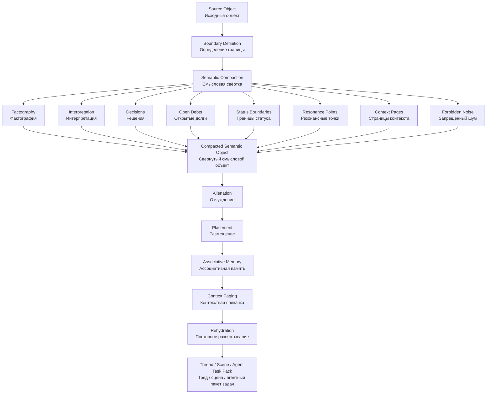
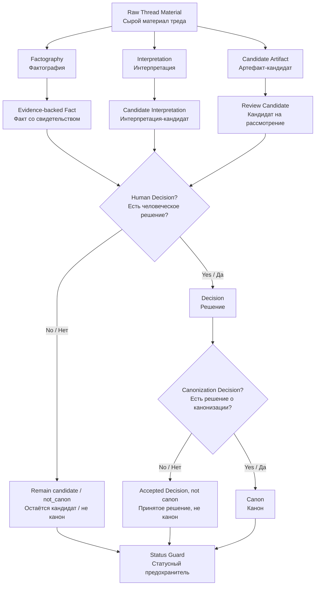
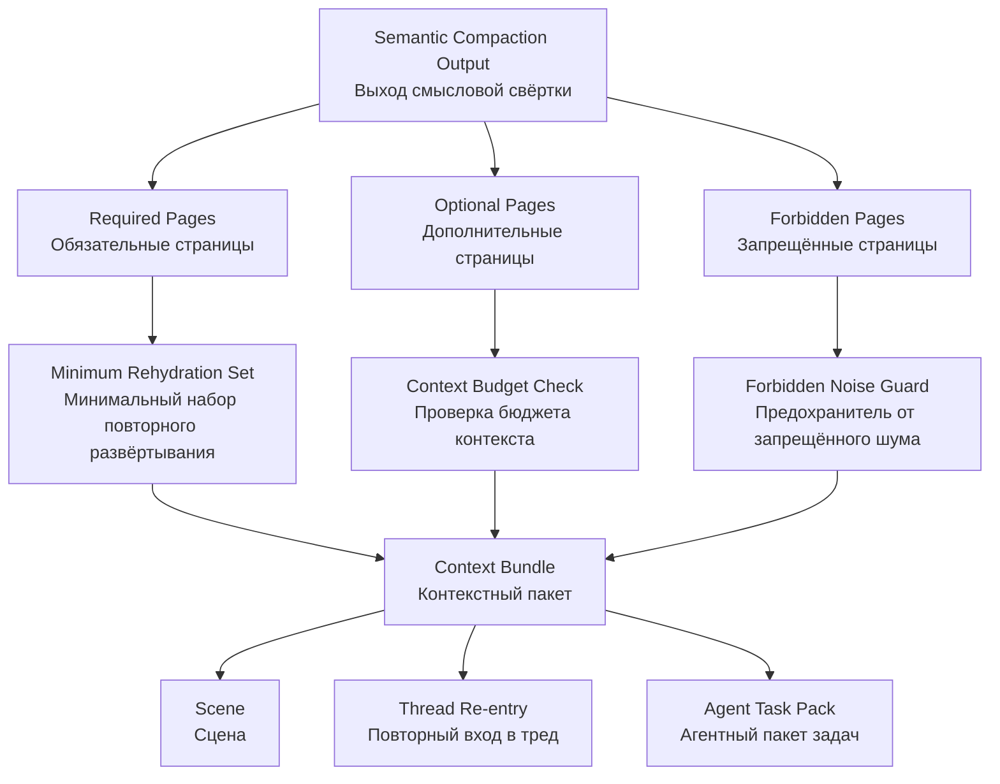

# Semantic Compaction Schema — STCR v0.1  
## Схема смысловой свёртки для подсистемы смысловой свёртки треда и повторного развёртывания

```yaml
artifact_id: SEMANTIC-COMPACTION-SCHEMA-STCR-ONE-MD-2026-06-24-v0.1
artifact_type: schema_candidate / one_markdown_document
status: candidate
canon_status: not_canon
project: IPaC_NIR_SEMANTIC_OS
parent_subsystem: Semantic Thread Compaction and Rehydration (смысловая свёртка треда и повторное развёртывание)
layer: P1 Schema Layer (слой схем P1)
created: 2026-06-24
short_code: STCR_SCS
git_commit_authorized: false
human_approval_required_for_git_commit: true
```

---

# 0. Оглавление

- [1. Статусный предохранитель](#1-статусный-предохранитель)
- [2. Назначение документа](#2-назначение-документа)
- [3. Почему эта схема нужна](#3-почему-эта-схема-нужна)
- [4. Место схемы в архитектуре IPaC OS](#4-место-схемы-в-архитектуре-ipac-os)
- [5. Базовое различение: summary и Semantic Compaction](#5-базовое-различение-summary-и-semantic-compaction)
- [6. Вход смысловой свёртки](#6-вход-смысловой-свёртки)
- [7. Выход смысловой свёртки](#7-выход-смысловой-свёртки)
- [8. Schema Core](#8-schema-core)
- [9. Обязательные блоки схемы](#9-обязательные-блоки-схемы)
- [10. Схема 1 — общий поток свёртки](#10-схема-1--общий-поток-свёртки)
- [11. Схема 2 — разделение статусов](#11-схема-2--разделение-статусов)
- [12. Схема 3 — переход к Context Paging](#12-схема-3--переход-к-context-paging)
- [13. Acceptance Criteria](#13-acceptance-criteria)
- [14. Anti-patterns](#14-anti-patterns)
- [15. Связь с P0-документами](#15-связь-с-p0-документами)
- [16. QA-блок](#16-qa-блок)
- [17. Routing-блок](#17-routing-блок)
- [18. Open Debts](#18-open-debts)
- [19. PROJECT_SUPERVISOR_STATE](#19-project_supervisor_state)

---

# 1. Статусный предохранитель

Этот документ является **candidate (кандидат)** и **not canon (не канон)**.

Он не является:

```text
canon (каноном);
final architecture (финальной архитектурой);
approved standard (утверждённым стандартом);
разрешением на Git commit (Git-проводку);
разрешением на promotion (повышение статуса);
заменой Human Approval (человеческого одобрения).
```

Документ оформляет первый элемент **P1 Schema Layer (слоя схем P1)** после завершения рабочего кандидатного уровня **P0 Safety and Status Hardening (усиление безопасности и статусов P0)**.

---

# 2. Назначение документа

**Semantic Compaction Schema (схема смысловой свёртки)** задаёт обязательную выходную структуру для операции Semantic Compaction (смысловой свёртки).

Цель схемы — не сделать красивый summary (краткий пересказ), а сохранить рабочую смысловую способность:

```text
что произошло;
почему это важно;
какой статус имеет;
что является фактом;
что является интерпретацией;
что является решением;
что является кандидатом;
что не является каноном;
какие долги открыты;
что нужно подкачать;
что нельзя тащить дальше;
как восстановить работу в новом Thread (треде) или Scene (сцене).
```

---

# 3. Почему эта схема нужна

Экспертное review (рассмотрение) указало главный риск: **Summary Drift (дрейф в краткий пересказ)**.

Если Semantic Compaction (смысловая свёртка) не имеет строгой схемы, она может деградировать в обычный summary (краткий пересказ):

```text
красиво написано;
понятно читается;
но нельзя продолжить работу;
потеряны статусы;
потеряны открытые долги;
потеряны источники;
потеряна граница между factography (фактографией),
interpretation (интерпретацией), decision (решением) и canon (каноном).
```

Поэтому Semantic Compaction (смысловая свёртка) должна быть не жанром текста, а schema-bound operation (операцией, связанной схемой).

---

# 4. Место схемы в архитектуре IPaC OS

В IPaC OS (IPaC смысловой ОС) эта схема соединяет:

```text
Supervisor (супервизор);
Semantic I/O Layer (смысловой слой ввода-вывода);
Register Save Block (блок сохранения регистров);
Save–Transfer–Restore Area (Область Сохранения — Передачи — Восстановления);
Associative Memory Subsystem (подсистема ассоциативной памяти);
Virtual Context Paging Subsystem (подсистема виртуальной контекстной подкачки);
Scene-based Agentic Work (сценовая агентная работа).
```

Она работает как формат сохранения регистров перед переносом смысловой работы.

---

# 5. Базовое различение: summary и Semantic Compaction

| Параметр | Summary (краткий пересказ) | Semantic Compaction (смысловая свёртка) |
|---|---|---|
| Цель | Сжать текст | Сохранить рабочую смысловую способность |
| Главный результат | Читабельное резюме | Восстановимый операционный контекст |
| Статусы | Часто смешиваются | Разделяются явно |
| Источники | Могут исчезнуть | Фиксируются через provenance (происхождение) |
| Open Debts (открытые долги) | Часто теряются | Обязательны |
| Next Actions (следующие действия) | Могут быть неявны | Обязательны |
| Context Pages (страницы контекста) | Обычно не выделяются | Выделяются явно |
| Forbidden Noise (запрещённый шум) | Обычно не фиксируется | Фиксируется явно |
| Rehydration (повторное развёртывание) | Не гарантируется | Является целью |

Ключевая формула:

```text
Summary (краткий пересказ) отвечает:
  "о чём был текст?"

Semantic Compaction (смысловая свёртка) отвечает:
  "как продолжить работу без потери смысловой высоты?"
```

---

# 6. Вход смысловой свёртки

Входом Semantic Compaction (смысловой свёртки) может быть:

```text
Thread Segment (сегмент треда);
Day Closeout (закрытие дня);
Scrum Boundary (граница скрама);
Consultant Review (консультантское рассмотрение);
Resource Pack (ресурсный пакет);
Process Regulation (процессное положение);
Failure Mode Register (реестр режимов отказа);
Context Paging Policy (политика контекстной подкачки);
Scene Candidate (кандидат сцены);
Agent Task Pack (агентный пакет задач).
```

Минимальный входной блок:

```yaml
source_object:
  source_type:
  source_name:
  source_location:
  source_status:
  source_canon_status:
  source_date:
  source_owner:
  source_provenance:
  source_evidence:
```

---

# 7. Выход смысловой свёртки

Выход Semantic Compaction (смысловой свёртки) — это **Compacted Semantic Object (свёрнутый смысловой объект)**.

Он должен быть пригоден для:

```text
Alienation (отчуждения);
Placement (размещения);
Resource Entry (ресурсной записи);
Context Paging (контекстной подкачки);
Rehydration (повторного развёртывания);
Scene (сцены);
Agent Task Pack (агентного пакета задач).
```

---

# 8. Schema Core

Ниже минимальная схема Compacted Semantic Object (свёрнутого смыслового объекта).

```yaml
compaction_id:
compaction_title:
created:
status: candidate
canon_status: not_canon

source:
  source_type:
  source_name:
  source_location:
  source_thread:
  source_segment_boundary:
  source_date:
  provenance:
  evidence:
    - 

scope:
  included:
    - 
  excluded:
    - 
  boundary_reason:

factography:
  - fact_id:
    statement:
    source:
    confidence:
    status:

interpretation:
  - interpretation_id:
    statement:
    basis:
    confidence:
    status: candidate_interpretation

decisions:
  proposed:
    - decision_id:
      statement:
      source:
      status: proposed
  accepted:
    - decision_id:
      statement:
      source:
      status: accepted
  rejected:
    - decision_id:
      statement:
      source:
      status: rejected
  superseded:
    - decision_id:
      statement:
      replaced_by:
      status: superseded
  canonized:
    - decision_id:
      statement:
      canon_reference:
      status: canonized

status_boundaries:
  candidate:
    - 
  review:
    - 
  decision:
    - 
  canon:
    - 
  not_canon:
    - 

open_debts:
  - debt_id:
    description:
    owner:
    priority:
    next_action:

resonance_points:
  - point_id:
    description:
    why_resonant:
    possible_routing:
    branch_status:

branch_parking:
  - branch_id:
    name:
    why_resonant:
    risk_if_followed_now:
    recommended_routing:
    return_to_mainline:

context_pages:
  required:
    - page_id:
      title:
      restores:
      reason:
  optional:
    - page_id:
      title:
      use_if:
      reason:
  forbidden:
    - page_id:
      title:
      risk:
      reason:

forbidden_carry_over_noise:
  - noise_id:
    description:
    why_forbidden:

rehydration_anchor:
  active_focus:
  minimum_context_set:
    - 
  next_recommended_action:
  prohibitions:
    - 

qa:
  status_guard_present: true
  provenance_present: true
  open_debts_present: true
  context_pages_classified: true
  human_review_required: true
  git_commit_authorized: false

output_routing:
  target_register:
  resource_entry:
  follow_up_artifacts:
    - 
```

---

# 9. Обязательные блоки схемы

## 9.1 Factography (фактография)

Factography (фактография) фиксирует только то, что произошло или было явно подтверждено.

Примеры:

```text
файл создан;
пакет размещён;
пользователь подтвердил визуальную проверку;
скрипт прошёл Dry Run (сухой прогон);
Git commit (Git-проводка) не выполнена.
```

Запрещено помещать interpretation (интерпретацию) в factography (фактографию).

---

## 9.2 Interpretation (интерпретация)

Interpretation (интерпретация) фиксирует смысловое объяснение фактов.

Пример:

```text
успешное размещение Process Regulation (процессного положения)
повышает зрелость P0 stack (стека P0),
но не делает документ canon (каноном).
```

---

## 9.3 Decisions (решения)

Decisions (решения) должны быть разделены:

```text
proposed (предложенные);
accepted (принятые);
rejected (отклонённые);
superseded (заменённые);
canonized (канонизированные).
```

Если Human Architect (человеческий архитектор) не дал явного решения, decision (решение) не должно повышаться до accepted (принятого) или canonized (канонизированного).

---

## 9.4 Status Boundaries (границы статуса)

Обязательные статусы:

```text
candidate (кандидат);
review (рассмотрение);
decision (решение);
canon (канон);
not_canon (не канон).
```

Каждая Semantic Compaction (смысловая свёртка) должна явно указывать, что не является canon (каноном).

---

## 9.5 Open Debts (открытые долги)

Open Debts (открытые долги) — это то, что нельзя потерять при продолжении.

Пример:

```text
оформить Semantic Compaction Schema (схему смысловой свёртки);
проверить Mermaid Scheme (Mermaid-схему);
не делать Git commit (Git-проводку);
подготовить Context Bundle (контекстный пакет).
```

---

## 9.6 Resonance Points (резонансные точки)

Resonance Points (резонансные точки) — это смысловые места, которые могут стать будущими artifacts (артефактами), rules (правилами), scenes (сценами) или context pages (страницами контекста).

---

## 9.7 Branch Parking (парковка ветвей)

Branch Parking (парковка ветвей) не даёт интересным веткам захватывать Mainline (магистраль).

Формат:

```yaml
branch_id:
name:
why_resonant:
possible_value:
risk_if_ignored:
risk_if_followed_now:
recommended_routing:
return_to_mainline:
```

---

## 9.8 Context Pages (страницы контекста)

Context Pages (страницы контекста) должны быть разделены на:

```text
required (обязательные);
optional (дополнительные);
forbidden (запрещённые).
```

Это предотвращает Overpaging (избыточную подкачку) и Underpaging (недоподкачку).

---

## 9.9 Forbidden Carry-over Noise (запрещённый перенос шума)

Forbidden Carry-over Noise (запрещённый перенос шума) — это всё, что не должно быть перенесено в новый Thread (тред), Scene (сцену) или Agent Task Pack (агентный пакет задач), даже если связано с темой.

---

## 9.10 Rehydration Anchor (якорь повторного развёртывания)

Rehydration Anchor (якорь повторного развёртывания) должен позволить восстановить:

```text
active focus (активный фокус);
status boundaries (границы статуса);
open debts (открытые долги);
next actions (следующие действия);
prohibitions (запреты);
minimum context set (минимальный набор контекста).
```

---

# 10. Схема 1 — общий поток свёртки

Описание: схема показывает, как Thread Segment (сегмент треда) или другой source object (исходный объект) проходит через Semantic Compaction (смысловую свёртку), превращается в Compacted Semantic Object (свёрнутый смысловой объект), затем идёт в Alienation (отчуждение), Placement (размещение), Context Paging (контекстную подкачку) и Rehydration (повторное развёртывание).



---

# 11. Схема 2 — разделение статусов

Описание: схема показывает, что factography (фактография), interpretation (интерпретация), decision (решение) и canon (канон) не должны схлопываться. Любой переход вверх по статусу требует Human Approval (человеческого одобрения) или Human Decision (человеческого решения).



---

# 12. Схема 3 — переход к Context Paging

Описание: схема показывает, как Semantic Compaction Schema (схема смысловой свёртки) готовит выходные Context Pages (страницы контекста), которые затем проходят через Context Paging Policy (политику контекстной подкачки).



---

# 13. Acceptance Criteria

Semantic Compaction (смысловая свёртка) проходит проверку, если:

```text
[PASS] Есть source object (исходный объект).
[PASS] Указана boundary (граница).
[PASS] Есть factography (фактография).
[PASS] Interpretation (интерпретация) отделена от factography (фактографии).
[PASS] Decisions (решения) разнесены по статусам.
[PASS] Удержан status guard (статусный предохранитель).
[PASS] Есть open debts (открытые долги).
[PASS] Есть next actions (следующие действия).
[PASS] Есть context pages (страницы контекста).
[PASS] Context pages (страницы контекста) разделены на required / optional / forbidden
       (обязательные / дополнительные / запрещённые).
[PASS] Есть forbidden carry-over noise (запрещённый перенос шума).
[PASS] Есть rehydration anchor (якорь повторного развёртывания).
[PASS] Git commit (Git-проводка) не разрешена без Human Approval
       (человеческого одобрения).
```

---

# 14. Anti-patterns

## 14.1 Beautiful Summary Trap (ловушка красивого пересказа)

Признак:

```text
текст выглядит хорошо,
но из него нельзя восстановить работу.
```

Ответ:

```text
вернуть документ в Semantic Compaction Schema (схему смысловой свёртки).
```

---

## 14.2 Status Blur (размытие статусов)

Признак:

```text
candidate (кандидат) начинает звучать как canon (канон).
```

Ответ:

```text
включить Status Guard (статусный предохранитель);
создать Errata (исправление), если нужно.
```

---

## 14.3 Debt Loss (потеря долгов)

Признак:

```text
после свёртки непонятно, что делать дальше.
```

Ответ:

```text
восстановить Open Debts (открытые долги)
и Next Actions (следующие действия).
```

---

## 14.4 Overpaging by Compaction (избыточная подкачка через свёртку)

Признак:

```text
свёртка тащит слишком много фрагментов как required context
(обязательный контекст).
```

Ответ:

```text
разделить pages (страницы) на required / optional / forbidden
(обязательные / дополнительные / запрещённые).
```

---

# 15. Связь с P0-документами

Этот документ опирается на:

```text
PROCESS_REGULATION_SEMANTIC_THREAD_COMPACTION_REHYDRATION_candidate_v0_1.md
  Process Regulation (процессное положение)

FAILURE_MODE_REGISTER_SEMANTIC_THREAD_COMPACTION_REHYDRATION_candidate_v0_1.md
  Failure Mode Register (реестр режимов отказа)

CONTEXT_PAGING_POLICY_STCR_candidate_v0_1.md
  Context Paging Policy (политика контекстной подкачки)
```

Связь:

```text
Process Regulation (процессное положение)
  говорит, когда и как запускать свёртку.

Failure Mode Register (реестр режимов отказа)
  говорит, как свёртка может сломаться.

Context Paging Policy (политика контекстной подкачки)
  говорит, как использовать выход свёртки для подкачки контекста.
```

---

# 16. QA-блок

```yaml
qa_status: GREEN_WITH_OPEN_DEBTS
resource_readiness: ready_for_candidate_placement
canon_readiness: no
commit_readiness: not_yet

checks:
  status_candidate_present: true
  not_canon_present: true
  schema_core_present: true
  factography_separated: true
  interpretation_separated: true
  decisions_status_split: true
  open_debts_required: true
  context_pages_required_optional_forbidden: true
  rehydration_anchor_present: true
  mermaid_schemes_embedded: true
  human_approval_required_for_git_commit: true
```

Open QA debts (открытые долги контроля качества):

```text
- проверить первый реальный пример Semantic Compaction (смысловой свёртки);
- связать с Rehydration Acceptance Test (приёмочным тестом повторного развёртывания);
- позже оформить Resource Entry Schema (схему ресурсной записи);
- позже оформить Context Page Manifest (манифест страницы контекста).
```

---

# 17. Routing-блок

Рекомендуемое размещение:

```text
11_COS_ARCHITECTURE_PROJECT_DECISIONS/04_PROCESS_DECISIONS/
  SEMANTIC_COMPACTION_SCHEMA_STCR_ONE_MD_2026-06-24_v0_1.md
```

Дополнительная ресурсная зона:

```text
09_SOURCE_PACKAGES/stcr_schema_layer/
  SEMANTIC_COMPACTION_SCHEMA_STCR_ONE_MD_2026-06-24_v0_1.md
```

Review (рассмотрение):

```text
08_TRACE_AND_DECISIONS/reviews/
  при необходимости:
  QA_SEMANTIC_COMPACTION_SCHEMA_STCR_2026-06-24_v0_1.md
```

Git policy (политика Git):

```text
git add (Git-добавление):
  только targeted (точечное) и только после Human Approval
  (человеческого одобрения).

git commit (Git-проводка):
  не разрешена этим документом.

git add .:
  запрещён.
```

---

# 18. Open Debts

```text
- провести Human Visual Verification (человеческую визуальную проверку);
- применить схему к реальному Thread Segment (сегменту треда);
- собрать Rehydration Acceptance Test (приёмочный тест повторного развёртывания);
- подготовить Resource Entry Schema (схему ресурсной записи);
- подготовить Context Page Manifest (манифест страницы контекста);
- не повышать статус до canon (канона) без отдельного Human Decision
  (человеческого решения).
```

---

# 19. PROJECT_SUPERVISOR_STATE

```yaml
PROJECT_SUPERVISOR_STATE:
  active_focus: "P1-1 Semantic Compaction Schema (схема смысловой свёртки) для STCR"
  current_artifact: "SEMANTIC_COMPACTION_SCHEMA_STCR_ONE_MD_2026-06-24_v0_1.md"
  open_debts:
    - "Human Visual Verification (человеческая визуальная проверка)"
    - "Rehydration Acceptance Test (приёмочный тест повторного развёртывания)"
    - "Resource Entry Schema (схема ресурсной записи)"
    - "Context Page Manifest (манифест страницы контекста)"
    - "Git commit (Git-проводка) запрещена без Human Approval (человеческого одобрения)"
  next_recommended_action: "разместить один Markdown document (Markdown-документ) в Obsidian Vault (хранилище Obsidian) и проверить Mermaid schemes (Mermaid-схемы)"
  risk_of_premature_canonization: "medium"
  status: "P1_1_SEMANTIC_COMPACTION_SCHEMA_READY_AS_ONE_MD_CANDIDATE"
```
