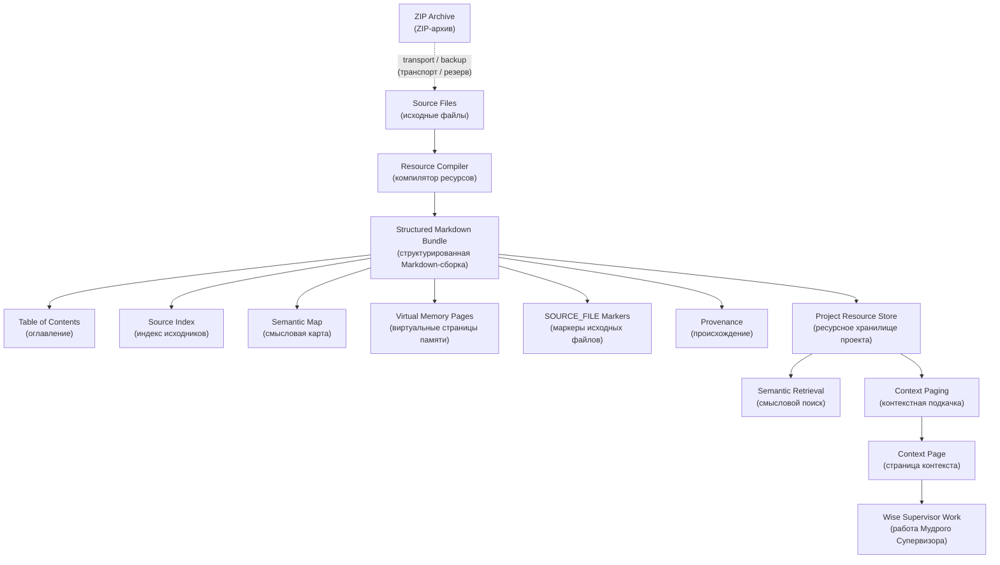

# S05 — Resource Store Boundary and Single Markdown Bundle Policy v0.1
## Граница ресурсного хранилища и политика единой Markdown-сборки

```yaml
artifact_id: S05-GATEWAY-L1-RESOURCE-STORE-BOUNDARY-AND-SINGLE-MD-BUNDLE-POLICY-v0.1
artifact_type: all_in_one_decision_rule_addendum_recommendation_diagram_pack
artifact_status: candidate / Gateway L1 (кандидат / Шлюз L1)
canon_status: not_canon (не канон)
created_for_project: IPaC_NIR_SEMANTIC_OS
created_for_contour: IPAC_WISE_SUPERVISOR_TEST_LAB
created_at: 2026-06-28
language_config: ru
machine_terms_policy: Every English term (английский термин) must include Russian translation in parentheses.
human_approval_required: true
git_authority: false_until_human_approval
promotion_authority: false
```

---

# 0. Статус фиксации

Этот артефакт фиксирует практическое открытие, полученное при развёртывании Wise Supervisor (Мудрого Супервизора) в отдельном ChatGPT Project (проекте ChatGPT).

Статус:

```text
Gateway L1 Candidate (кандидат Шлюза L1).
```

Это означает:

```text
Можно использовать как рабочую архитектурную гипотезу и операционное правило
внутри текущего испытательного контура.

Нельзя считать canon (каноном) до review (рассмотрения),
decision (решения) и Git transaction (Git-проводки).
```

---

# 1. Краткое решение-кандидат

```text
Для крупных подсистем IPaC, загружаемых в ChatGPT Project (проект ChatGPT),
основной единицей загрузки должен быть не набор мелких файлов,
а один хорошо структурированный Markdown Bundle (Markdown-сборка).
```

Главная формула:

```text
Project file (файл проекта) — дорогой слот Resource Store (ресурсного хранилища).

Одна физическая Project file (файл проекта)
может содержать множество virtual Memory Pages (виртуальных страниц памяти),
если она структурирована как compound Memory Page (составная страница памяти).
```

---

# 2. Фактография практического открытия

## 2.1 Исходная задача

Для развёртывания Wise Supervisor (Мудрого Супервизора) был подготовлен пакет W03 / S03.

Цель была загрузить ресурсный пакет в отдельный Project (проект) для Stage A (этапа A):

```text
independent validation (независимая валидация)
на существующей test matrix (матрице испытаний).
```

## 2.2 Наблюдение 1 — папочная загрузка не прошла

Попытка загрузить папку `ws03` как folder upload (загрузка папки) не прошла: интерфейс разрешал только file upload (загрузку файлов).

## 2.3 Наблюдение 2 — плоская упаковка работала технически, но плохо архитектурно

Был собран flat upload pack (плоский пакет загрузки):

```text
source_root:
C:\Users\Michael\Documents\50-00 IPaC\0. IPaC Project\IPaC_Obsidian_Vault_Str_v0_1_Pack\09_SOURCE_PACKAGES\ws03

output_root:
C:\Users\Michael\Downloads\W03_UPLOAD_FLAT_20260628_091023

file_count: 34
```

Плоская упаковка сохранила provenance (происхождение) через имена вида:

```text
W03_T__D__R__ACCT.md
W03_T__X__TP.md
```

Но она почти исчерпала Resource Store file budget (файловый бюджет ресурсного хранилища).

## 2.4 Наблюдение 3 — лимит файлов проявился как архитектурная граница

До W03 уже были загружены S02 files (файлы S02). После добавления 34 W03 files (файлов W03) и service files (служебных файлов) контур упёрся в file count limit (лимит количества файлов). Часть файлов не смогла быть загружена или удалена сразу.

Практический вывод:

```text
ChatGPT Project (проект ChatGPT) нельзя трактовать как обычную file system (файловую систему).
Это ограниченный Resource Store (ресурсное хранилище) с дорогими слотами.
```

---

# 3. Скрытые знания, извлечённые из трассы

## 3.1 Физическая дробность файлов не равна смысловой дробности

Ранее неявно использовалась формула:

```text
один файл = одна смысловая единица
```

Новая формула:

```text
один физический файл может содержать много смысловых единиц,
если внутри него есть virtual paging (виртуальная страничность).
```

## 3.2 Один структурированный файл может быть лучше пяти разрозненных

Пять thematic bundles (тематических сборок) лучше, чем тридцать четыре мелких файла, если каждый bundle (сборка) имеет смысловую роль.

Но один well-structured Markdown Bundle (хорошо структурированная Markdown-сборка) лучше пяти, если внутри него есть:

```text
Table of Contents (оглавление);
Source Index (индекс исходников);
Semantic Map (смысловая карта);
Virtual Pages (виртуальные страницы);
SOURCE_FILE Markers (маркеры исходных файлов);
Usage Instruction (инструкция использования);
Provenance (происхождение);
Status Guard (статусный предохранитель).
```

## 3.3 ZIP Archive (ZIP-архив) — транспорт, не память

```text
ZIP Archive (ZIP-архив) = transport container (транспортный контейнер).
Markdown Bundle (Markdown-сборка) = readable compound Memory Page
(читаемая составная страница памяти).
```

ZIP Archive (ZIP-архив) может быть хорошим Transport Artifact (транспортным артефактом), но primary memory unit (основная единица памяти) для Project Resource Store (ресурсного хранилища проекта) должна быть readable text (читаемым текстом), а не opaque container (непрозрачным контейнером).

## 3.4 Возник новый архитектурный объект — Resource Compiler (компилятор ресурсов)

Resource Compiler (компилятор ресурсов) — кандидат компонента Semantic I/O Layer (смыслового слоя ввода-вывода).

Назначение:

```text
принимать множество source files (исходных файлов);
сохранять original paths (исходные пути);
собирать Source Index (индекс исходников);
создавать Semantic Map (смысловую карту);
встраивать SOURCE_FILE markers (маркеры исходных файлов);
порождать один upload-ready Markdown Bundle
(готовую к загрузке Markdown-сборку).
```

---

# 4. Уточнение объектных границ

## 4.1 Artifact (артефакт)

Artifact (артефакт) — содержательный отчуждённый объект: документ, правило-кандидат, схема, отчёт, пакет, ZIP Archive (ZIP-архив), Markdown Bundle (Markdown-сборка).

## 4.2 Resource Entry (ресурсная запись)

Resource Entry (ресурсная запись) — адресно-управляющая карточка Artifact (артефакта): что это, где лежит, какой status (статус), как использовать, какой provenance (происхождение), какие ограничения.

## 4.3 Memory Page (страница памяти)

Memory Page (страница памяти) — нормализованная единица Associative Memory (ассоциативной памяти), пригодная для поиска, связей, подкачки и восстановления.

Artifact (артефакт) становится Memory Page (страницей памяти) только после минимальной нормализации:

```text
status (статус);
provenance (происхождение);
semantic payload (смысловая нагрузка);
routing (маршрутизация);
links (связи);
usage instruction (инструкция использования);
status guard (статусный предохранитель).
```

## 4.4 Context Page (страница контекста)

Context Page (страница контекста) — Memory Page (страница памяти), выбранная для текущей Scene (сцены), Thread (треда), Agent Task Pack (агентного пакета задач), Rehydration Brief (брифа повторного развёртывания) или Project (проекта).

## 4.5 Compound Memory Page (составная страница памяти)

Compound Memory Page (составная страница памяти) — один физический файл, содержащий несколько virtual Memory Pages (виртуальных страниц памяти).

Именно таким должен быть `W03C_ALL.md`.

---

# 5. Decision Candidate (кандидат решения)

```yaml
decision_id: DECISION-CANDIDATE-S05-001
status: Gateway L1 Candidate (кандидат Шлюза L1)
title: Single Markdown Bundle per Subsystem (одна Markdown-сборка на подсистему)
```

Для сложных подсистем IPaC, которые должны быть загружены в ChatGPT Project (проект ChatGPT), использовать единый structured Markdown Bundle (структурированную Markdown-сборку) вместо множества мелких файлов.

## 5.1 Обоснование

```text
1. Project Resource Store (ресурсное хранилище проекта) имеет ограниченный file budget
   (файловый бюджет).

2. Мелкие файлы хороши для Git (Гит) и Obsidian (хранилища Obsidian),
   но плохи для ограниченного Project Resource Store (ресурсного хранилища проекта).

3. Один структурированный Markdown Bundle (Markdown-сборка) сохраняет внутреннюю
   смысловую дробность через virtual pages (виртуальные страницы).

4. ZIP Archive (ZIP-архив) остаётся transport backup (транспортным резервом),
   но не основной единицей смысловой подкачки.

5. Для будущих подсистем сложность будет расти, поэтому нужно закрепить правило
   до накопления хаоса.
```

## 5.2 Решение-кандидат

```text
Принять для Gateway L1 (Шлюза L1) правило:

одна крупная подсистема IPaC
→ один основной Markdown Bundle (Markdown-сборка)
→ множество virtual Memory Pages (виртуальных страниц памяти) внутри.
```

---

# 6. Rule Candidate (кандидат правила)

## PROJECT_RESOURCE_STORE_BUDGET_AND_BUNDLE_PACKAGING_RULE_v0_1

```yaml
rule_id: PROJECT-RESOURCE-STORE-BUDGET-AND-BUNDLE-PACKAGING-RULE-v0.1
rule_status: candidate / Gateway L1 (кандидат / Шлюз L1)
scope: ChatGPT Project resources (ресурсы проекта ChatGPT)
```

## 6.1 Правило файлового бюджета

Для служебно-ресурсного слоя Project (проекта) целевой бюджет:

```text
не более 30% доступных file slots (файловых слотов)
на infrastructure resources (инфраструктурные ресурсы).
```

Практический ориентир:

```text
около 12 files (файлов) на служебно-ресурсный слой
при лимите порядка 40 files (файлов).
```

## 6.2 Правило упаковки подсистем

Каждая крупная подсистема должна поставляться как один основной файл:

```text
<SubsystemCode>_ALL.md
```

Примеры:

```text
W03C_ALL.md — Wise Supervisor (Мудрый Супервизор);
OIC_ALL.md — Operational Interaction Contour (контур оперативного взаимодействия);
ISR_ALL.md — Interrupt / Save / Restore (прерывания / сохранение / восстановление);
HCI_ALL.md — Hybrid Cognitive Interaction (гибридное когнитивное взаимодействие).
```

## 6.3 Обязательная структура Markdown Bundle (Markdown-сборки)

```text
0. Operator Note (операторская пометка)
1. Table of Contents (оглавление)
2. Source Index (индекс исходников)
3. Semantic Map (смысловая карта)
4. Usage Instruction (инструкция использования)
5. Status Guard (статусный предохранитель)
6. Virtual Page Index (индекс виртуальных страниц)
7. Bundled Source Files (собранные исходные файлы)
8. Provenance and SHA (происхождение и SHA)
9. Change Notes (заметки изменений)
```

## 6.4 Правило приоритета при остаточных файлах

Если в Project Resource Store (ресурсном хранилище проекта) остались legacy fragments (остаточные фрагменты) вида `W03_...`, то:

```text
Authoritative source (авторитетный источник) = W03C_ALL.md.

Individual W03_ files (отдельные W03_ файлы)
считать legacy fragments (остаточными фрагментами),
если пользователь явно не запрашивает их анализ.
```

## 6.5 Правило Transport Artifact (транспортного артефакта)

```text
ZIP Archive (ZIP-архив) разрешён как backup (резерв),
handoff package (пакет передачи) или asset package (пакет активов).

ZIP Archive (ZIP-архив) не является primary Project memory resource
(основным ресурсом памяти проекта), если нет явного подтверждения,
что Project (проект) распаковывает и индексирует его содержимое.
```

---

# 7. Deployment Addendum Candidate (кандидат аддендума развёртывания)

## DEP_ADDENDUM_RESOURCE_BUNDLE_POLICY_v0_1

```yaml
addendum_id: DEP-ADDENDUM-RESOURCE-BUNDLE-POLICY-v0.1
status: candidate / Gateway L1 (кандидат / Шлюз L1)
target: Wise Supervisor deployment (развёртывание Мудрого Супервизора)
```

## 7.1 Изменение процедуры W03

Старый вариант:

```text
Upload 09_SOURCE_PACKAGES/ws03/
(загрузить 09_SOURCE_PACKAGES/ws03/)
```

Новый вариант для Project Resource Store (ресурсного хранилища проекта):

```text
Build W03C_ALL.md
(собрать W03C_ALL.md)

Upload only W03C_ALL.md
(загрузить только W03C_ALL.md)
```

## 7.2 Новый порядок загрузки для IPAC_WS_TEST_LAB

```text
1. Загрузить S02 files (файлы S02).
2. Вставить Project Instructions (инструкции проекта).
3. Собрать W03C_ALL.md.
4. Загрузить W03C_ALL.md как единственный W03 resource (ресурс W03).
5. Не загружать historical thread (исторический тред) на Stage A (этапе A).
6. Запустить PROMPT_01 (промпт 01) в первом чате.
7. Провести boot validation tests (проверочные загрузочные тесты).
```

---

# 8. Recommendation Candidate (кандидат рекомендации)

## RECOMMENDATION-S05-001

Для будущих подсистем IPaC использовать pattern (паттерн):

```text
many internal source files (много внутренних исходных файлов)
→ one structured Markdown Bundle (одна структурированная Markdown-сборка)
→ virtual Memory Pages (виртуальные страницы памяти)
→ Project Resource Store (ресурсное хранилище проекта)
→ Context Page selection (выбор страницы контекста)
```

Подсистемы, к которым применить правило:

```text
Wise Supervisor (Мудрый Супервизор);
Operational Interaction Contour (контур оперативного взаимодействия);
Interrupt / Save / Restore Subsystem (подсистема прерываний / сохранения / восстановления);
Hybrid Cognitive Interaction Support Subsystem
(подсистема поддержки гибридного когнитивного взаимодействия);
Semantic I/O Layer (смысловой слой ввода-вывода);
Resource Compiler (компилятор ресурсов).
```

---

# 9. Mermaid Diagram (Mermaid-диаграмма)



---

# 10. Acceptance Checks (проверки приёмки)

Для прохождения Gateway L1 (Шлюза L1) правило считается операционно пригодным, если:

```text
1. W03C_ALL.md собирается из всех 34 source files (исходных файлов).
2. В W03C_ALL.md есть Source Index (индекс исходников).
3. В W03C_ALL.md есть SOURCE_FILE markers (маркеры исходных файлов).
4. В W03C_ALL.md есть Operator Note (операторская пометка).
5. Project (проект) после загрузки W03C_ALL.md может отвечать на вопросы
   по содержанию W03.
6. Legacy W03_ fragments (остаточные W03_ фрагменты) не мешают работе,
   потому что W03C_ALL.md объявлен authoritative source (авторитетным источником).
7. Общий service resource budget (служебный ресурсный бюджет)
   остаётся около 12 files (файлов) или меньше.
```

---

# 11. Proposed Git Transaction (предложенная Git-проводка)

До Git transaction (Git-проводки) запросить live status (живой статус):

```powershell
git status
```

Предлагаемый путь в Vault (хранилище):

```text
09_SOURCE_PACKAGES/ws05/S05_GATEWAY_L1_RESOURCE_STORE_BOUNDARY_AND_SINGLE_MD_BUNDLE_POLICY_v0_1.md
```

Предлагаемые дополнительные пути после review (рассмотрения), если будет решено разнести один пакет на отдельные документы:

```text
08_TRACE_AND_DECISIONS/decisions/DECISION_2026-06-28_PROJECT_RESOURCE_STORE_BOUNDARY_AND_SINGLE_MD_BUNDLE_POLICY_v0_1.md

06_PROJECT_RULES/PROJECT_RESOURCE_STORE_BUDGET_AND_BUNDLE_PACKAGING_RULE_v0_1.md

09_SOURCE_PACKAGES/ws04/G/DEP_ADDENDUM_RESOURCE_BUNDLE_POLICY_v0_1.md

06_PROJECT_RULES/PROJECT_RESOURCE_STORE_COMPOUND_MEMORY_PAGE_FLOW_v0_1.mmd

08_TRACE_AND_DECISIONS/reviews/RECOMMENDATION_2026-06-28_SINGLE_MD_BUNDLE_FOR_PROJECT_RESOURCES_v0_1.md
```

Предлагаемый commit message (сообщение Git-проводки):

```text
architecture: add gateway l1 resource store bundle policy candidate
```

Не выполнять Git transaction (Git-проводку) без human approval (человеческого одобрения).

---

# 12. PROJECT_SUPERVISOR_STATE

```yaml
PROJECT_SUPERVISOR_STATE:
  active_focus:
    Resource Store Boundary (граница ресурсного хранилища)
    and Single Markdown Bundle Policy (политика единой Markdown-сборки)

  current_artifact:
    S05_GATEWAY_L1_RESOURCE_STORE_BOUNDARY_AND_SINGLE_MD_BUNDLE_POLICY_v0_1.md

  status:
    candidate / Gateway L1 (кандидат / Шлюз L1)

  open_debts:
    - build W03C_ALL.md (собрать W03C_ALL.md)
    - upload W03C_ALL.md into IPAC_WS_TEST_LAB (загрузить W03C_ALL.md в IPAC_WS_TEST_LAB)
    - run boot validation (провести проверку загрузки)
    - split this all-in-one pack into formal files only after review (разнести пакет на формальные файлы только после рассмотрения)
    - request live git status before any Git transaction (запросить живой статус Git перед любой Git-проводкой)

  next_recommended_action:
    build W03C_ALL.md (собрать W03C_ALL.md)

  risk_of_premature_canonization:
    medium
    explanation:
      Практическое знание сильное, но пока имеет статус Gateway L1 Candidate
      (кандидат Шлюза L1), не canon (не канон).
```

---

# 13. Closing Formula (закрывающая формула)

```text
Мы не просто обошли лимит файлов.

Мы обнаружили границу Project Resource Store
(ресурсного хранилища проекта)
и вывели правило Semantic I/O Layer
(смыслового слоя ввода-вывода):

смысловая ОС должна компилировать множество исходных файлов
в один читаемый, индексированный, отчуждаемый compound resource
(составной ресурс),
пригодный для context paging (контекстной подкачки)
и восстановления состояния.
```
