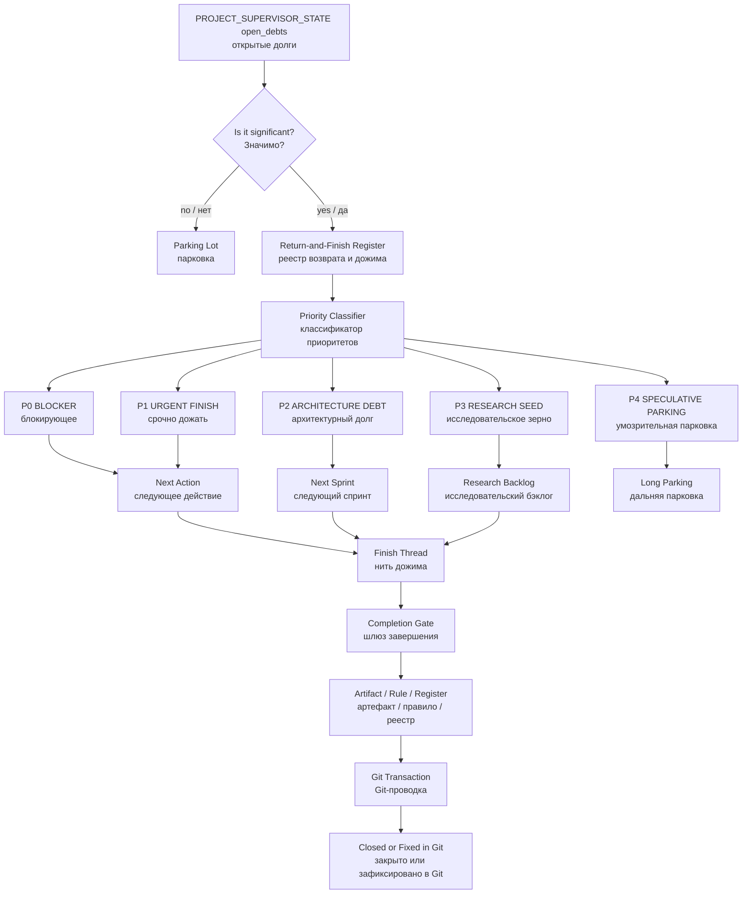

# S06 — Return-and-Finish Register and Priority Classifier v0.1
## Реестр возврата и дожима и классификатор приоритетов

```yaml
artifact_id: S06-GATEWAY-L1-RETURN-AND-FINISH-REGISTER-PRIORITY-CLASSIFIER-v0.1
artifact_type: all_in_one_decision_rule_register_addendum_diagram_pack
artifact_status: Gateway L1 Candidate (кандидат Шлюза L1)
canon_status: not_canon (не канон)
created_for_project: IPaC_NIR_SEMANTIC_OS
created_for_contour: IPAC_WISE_SUPERVISOR_TEST_LAB
created_at: 2026-06-28
language_config: ru
machine_terms_policy: Every English term (английский термин) must include Russian translation in parentheses.
human_approval_required: true
git_authority: false_until_human_approval
promotion_authority: false
```

---

# 0. Статус фиксации

Этот артефакт фиксирует практическое открытие, полученное после S05 — Resource Store Boundary and Single Markdown Bundle Policy (граница ресурсного хранилища и политика единой Markdown-сборки).

Статус:

```text
Gateway L1 Candidate (кандидат Шлюза L1).
```

Это означает:

```text
Разрешено использовать как рабочую архитектурную гипотезу и операционное правило
в текущем контуре IPaC.

Запрещено считать canon (каноном) без review (рассмотрения),
decision (решения) и явного человеческого повышения статуса.
```

---

# 1. Краткое решение-кандидат

```text
Open debt (открытый долг) без реестровой записи —
это не управляемый долг, а риск потери смысла.
```

Поэтому в IPaC нужен отдельный Return-and-Finish Register (реестр возврата и дожима) и Priority Classifier (классификатор приоритетов).

Главная формула:

```text
PROJECT_SUPERVISOR_STATE.open_debts
не должен быть свободным списком.

Он должен быть окном в Return-and-Finish Register
(реестр возврата и дожима).
```

---

# 2. Фактография практического открытия

## 2.1 Наблюдение

После фиксации S05 возникли новые open debts (открытые долги):

```text
1. Вернуться к ontology (онтологии) Compound Memory Page (составной страницы памяти).
2. Оформить Downloads as Transfer Staging Only (Downloads как только зона временного переноса).
3. Собрать W03C_ALL.md как structured Markdown bundle (структурированную Markdown-сборку).
```

И была выявлена слабость: простой список open_debts (открытых долгов) не отвечает на вопросы:

```text
когда вернуться;
насколько срочно;
насколько важно;
что считается завершением;
куда должен лечь итог;
какой риск, если не вернуться;
является ли это блокирующим, архитектурным или умозрительным.
```

## 2.2 Вывод

Open debt (открытый долг) должен стать не строкой в состоянии, а управляемым объектом.

```text
Open debt (открытый долг)
→ Return Item (элемент возврата)
→ Priority Classification (классификация приоритета)
→ Finish Action (действие дожима)
→ Completion Gate (шлюз завершения)
→ Git Transaction (Git-проводка)
```

---

# 3. Онтология S06

## 3.1 Open Debt (открытый долг)

Open Debt (открытый долг) — это недозавершённый смысловой объект, действие, правило, решение, идея или проверка, которые уже признаны значимыми, но ещё не доведены до завершения.

Open Debt (открытый долг) опасен, если он не имеет:

```text
status (статуса);
priority (приоритета);
return trigger (триггера возврата);
next action (следующего действия);
completion gate (шлюза завершения);
owner / operator (ответственного оператора), если применимо;
provenance (происхождения).
```

## 3.2 Return Item (элемент возврата)

Return Item (элемент возврата) — нормализованная запись в Return-and-Finish Register (реестре возврата и дожима).

Он содержит не только описание долга, но и маршрут дожима.

## 3.3 Finish Thread (нить дожима)

Finish Thread (нить дожима) — цепочка действий, необходимых, чтобы вернуть смысловой объект из состояния open (открыто) или hold (удерживается) к одному из завершённых состояний:

```text
closed (закрыто);
fixed_in_git (зафиксировано в Git);
rejected (отклонено);
merged_into_other_artifact (слито в другой артефакт);
parked_with_review_date (припарковано с датой пересмотра).
```

## 3.4 Priority Classifier (классификатор приоритетов)

Priority Classifier (классификатор приоритетов) — система оценки Return Item (элемента возврата) по срочности, важности, зрелости, риску потери и влиянию на текущий фокус.

## 3.5 Completion Gate (шлюз завершения)

Completion Gate (шлюз завершения) — явное условие, после которого элемент можно закрыть.

Пример:

```text
W03C_ALL.md считается закрытым только после:
1. сборки единого structured Markdown bundle (структурированной Markdown-сборки);
2. успешной загрузки в IPAC_WS_TEST_LAB;
3. запуска boot prompt (загрузочного промпта);
4. получения WISE_SUPERVISOR_BOOT_OK или диагностического отчёта.
```

---

# 4. Return-and-Finish Register (реестр возврата и дожима)

Предлагаемый путь:

```text
02_REGISTERS/RETURN_AND_FINISH_REGISTER_v0_1.md
```

В статусе Gateway L1 Candidate (кандидат Шлюза L1) этот реестр пока фиксируется внутри настоящего S06 source package (исходного пакета S06). После review (рассмотрения) он может быть вынесен в отдельный файл реестра.

## 4.1 Обязательная структура записи

```yaml
return_item:
  id: RFR-YYYY-MM-DD-NNN
  title: short_title
  status: open | active | hold | ready_for_review | ready_for_git | closed
  priority: P0 | P1 | P2 | P3 | P4
  urgency: now | today | next_session | next_sprint | someday
  importance: blocking | architectural | operational | research_seed | speculative
  maturity: raw_signal | candidate | reviewed | decision_pending | fixed_in_git
  source_event: event_or_artifact
  provenance: source_reference
  return_trigger: when_to_return
  next_action: first_action_to_resume
  target_artifact: where_the_result_should_land
  completion_gate: explicit_close_condition
  risk_if_lost: what_is_lost_if_not_returned
  notes: optional_notes
```

## 4.2 Минимальная строка для PROJECT_SUPERVISOR_STATE

```yaml
open_debts:
  - id: RFR-2026-06-28-001
    title: Compound Memory Page ontology
    priority: P2_ARCHITECTURE_DEBT
    next_action: оформить ontology note (онтологическую заметку)
```

---

# 5. Priority Classifier (классификатор приоритетов)

## 5.1 Уровни приоритета

| Priority (приоритет) | Имя | Смысл | Типовое действие |
|---|---|---|---|
| P0 | BLOCKER (блокирующее) | Без этого нельзя продолжать текущую работу | Дожать немедленно |
| P1 | URGENT FINISH (срочно дожать) | Не блокирует всё, но опасно оставить хвостом | Закрыть сегодня или в ближайшей сессии |
| P2 | ARCHITECTURE DEBT (архитектурный долг) | Важная структура для архитектуры IPaC OS | Вернуться в ближайшем спринте |
| P3 | RESEARCH SEED (исследовательское зерно) | Ценная идея, не срочная | Зафиксировать и пересмотреть позже |
| P4 | SPECULATIVE PARKING (умозрительная парковка) | Возможная мысль, пока без операционного давления | Не тянуть в текущую работу |

## 5.2 Срочность

```text
now (сейчас)
today (сегодня)
next_session (следующая сессия)
next_sprint (следующий спринт)
someday (когда-нибудь)
```

## 5.3 Важность

```text
blocking (блокирующее)
architectural (архитектурное)
operational (операционное)
research_seed (исследовательское зерно)
speculative (умозрительное)
```

## 5.4 Зрелость

```text
raw_signal (сырой сигнал)
candidate (кандидат)
reviewed (рассмотрено)
decision_pending (ожидает решения)
fixed_in_git (зафиксировано в Git)
```

---

# 6. Правило-кандидат

Предлагаемый путь:

```text
06_PROJECT_RULES/RETURN_AND_FINISH_REGISTER_AND_PRIORITY_CLASSIFIER_RULE_v0_1.md
```

## 6.1 Правило

```text
Любой open debt (открытый долг), который назван в PROJECT_SUPERVISOR_STATE
более одного раза или имеет архитектурную / операционную ценность,
должен получить запись в Return-and-Finish Register
(реестре возврата и дожима).
```

## 6.2 Запрет

```text
Запрещено оставлять значимый open debt (открытый долг)
только в свободном тексте ответа.
```

## 6.3 Обязательное действие при прерывании

Перед interrupt (прерыванием), переходом в новый Thread (тред), Project (проект) или подсистему нужно обновить:

```text
PROJECT_SUPERVISOR_STATE;
Return-and-Finish Register (реестр возврата и дожима);
next recommended action (следующее рекомендованное действие).
```

---

# 7. Начальные записи Return-and-Finish Register (реестра возврата и дожима)

## RFR-2026-06-28-001 — Compound Memory Page ontology

```yaml
id: RFR-2026-06-28-001
title: Compound Memory Page ontology (онтология составной страницы памяти)
status: open
priority: P2_ARCHITECTURE_DEBT
urgency: next_sprint
importance: architectural
maturity: candidate
source_event: S05 Resource Store Boundary and Single Markdown Bundle Policy
provenance: practical W03 packaging precedent + S05 Gateway L1 Candidate
return_trigger: начало проектирования Memory Management Subsystem (подсистемы управления памятью)
next_action: оформить ontology note (онтологическую заметку) о compound Memory Page (составной странице памяти)
target_artifact: 03_RESEARCH_MAP или 06_PROJECT_RULES после review (рассмотрения)
completion_gate: создана отдельная онтологическая заметка или правило-кандидат
risk_if_lost: потеря языка для описания подсистемы управления памятью IPaC OS
```

## RFR-2026-06-28-002 — Downloads as Transfer Staging Only

```yaml
id: RFR-2026-06-28-002
title: Downloads as Transfer Staging Only (Downloads как только зона временного переноса)
status: open
priority: P1_URGENT_FINISH
urgency: next_session
importance: operational
maturity: candidate
source_event: S05 Git transaction debugging (отладка Git-проводки S05)
provenance: практическая ошибка смещения центра работы в Downloads
return_trigger: перед следующей автоматизированной Git-проводкой
next_action: оформить Trusted Worktree Boundary Rule (правило границы доверенного рабочего дерева)
target_artifact: 06_PROJECT_RULES/TRUSTED_WORKTREE_BOUNDARY_AND_TRANSFER_STAGING_RULE_v0_1.md
completion_gate: правило создано и проведено через Git или включено в S06/S07 source package (исходный пакет)
risk_if_lost: повторение ошибки, когда transport staging (транспортная зона) смешивается с Git worktree (рабочим деревом Git)
```

## RFR-2026-06-28-003 — W03C_ALL structured Markdown bundle

```yaml
id: RFR-2026-06-28-003
title: W03C_ALL.md structured Markdown bundle (структурированная Markdown-сборка W03C_ALL.md)
status: open
priority: P0_BLOCKER
urgency: now
importance: blocking
maturity: candidate
source_event: deployment of IPAC_WS_TEST_LAB (развёртывание IPAC_WS_TEST_LAB)
provenance: W03 flat upload failed by resource budget (ресурсный бюджет)
return_trigger: немедленно после закрытия S06 Git-проводки
next_action: собрать W03C_ALL.md как authoritative W03 source (авторитетный источник W03)
target_artifact: 09_SOURCE_PACKAGES/ws03/W03C_ALL.md или Downloads для загрузки в Project (проект) после сборки
completion_gate: W03C_ALL.md загружен в IPAC_WS_TEST_LAB и boot prompt (загрузочный промпт) запущен
risk_if_lost: зависание Stage A (этапа A) испытаний Wise Supervisor (Мудрого Супервизора)
```

## RFR-2026-06-28-004 — Open debts as register-backed supervisor state

```yaml
id: RFR-2026-06-28-004
title: Open debts as register-backed supervisor state (открытые долги как реестрово поддержанное состояние супервизора)
status: open
priority: P2_ARCHITECTURE_DEBT
urgency: next_sprint
importance: architectural
maturity: candidate
source_event: correction to PROJECT_SUPERVISOR_STATE.open_debts
provenance: пользовательская поправка после S05 Git-проводки
return_trigger: при проектировании Save–Transfer–Restore Area (Области Сохранения — Передачи — Восстановления)
next_action: включить Return-and-Finish Register (реестр возврата и дожима) в Register Save Block (блок сохранения регистров)
target_artifact: rule candidate (кандидат правила) для Interrupt System (системы прерываний)
completion_gate: open_debts в PROJECT_SUPERVISOR_STATE заменён ссылками на RFR-записи
risk_if_lost: потеря управляемости хвостов и повторное накопление неразнесённых смыслов
```

---

# 8. Связь с Interrupt System (системой прерываний)

Return-and-Finish Register (реестр возврата и дожима) является частью будущей Interrupt System (системы прерываний) и Save–Transfer–Restore Area (Области Сохранения — Передачи — Восстановления).

При переключении между Thread (тредом), Project (проектом), подсистемой или задачей нужно сохранять:

```text
активный фокус;
текущий артефакт;
Register Save Block (блок сохранения регистров);
Return-and-Finish Register links (ссылки на реестр возврата и дожима);
open Return Items (открытые элементы возврата);
priority (приоритет);
return trigger (триггер возврата);
next action (следующее действие).
```

---

# 9. Mermaid Diagram (Mermaid-диаграмма)



---

# 10. Decision Candidate (кандидат решения)

```yaml
decision_id: DECISION-2026-06-28-RETURN-AND-FINISH-REGISTER-GATEWAY-L1-CANDIDATE
status: Gateway L1 Candidate (кандидат Шлюза L1)
decision:
  Создать Return-and-Finish Register (реестр возврата и дожима)
  как обязательный механизм управления open_debts (открытыми долгами)
  в IPaC OS.

reason:
  Свободный список open_debts (открытых долгов) не удерживает
  срочность, важность, зрелость, trigger (триггер), next action
  (следующее действие) и completion gate (шлюз завершения).

not_canon:
  Решение не является canon (каноном) до review (рассмотрения)
  и последующего явного повышения статуса.
```

---

# 11. Deployment Addendum Candidate (кандидат аддендума развёртывания)

Для DEP (deployment guide / инструкция развёртывания) Wise Supervisor (Мудрого Супервизора) добавить:

```text
Перед переходом между этапами развёртывания:
1. фиксировать активные open_debts (открытые долги);
2. присваивать им RFR-id (идентификатор реестра возврата и дожима);
3. классифицировать P0–P4;
4. указывать return trigger (триггер возврата);
5. не продолжать Stage A (этап A), если есть P0 blocker (блокирующий долг).
```

Для текущего контура:

```text
RFR-2026-06-28-003 / W03C_ALL.md имеет Priority P0 (приоритет P0),
потому что без него Stage A (этап A) не может корректно продолжаться.
```

---

# 12. Acceptance Checks (проверки приёмки)

S06 считается прошедшим Gateway L1 (Шлюз L1), если:

```text
1. Понятно, почему open_debts (открытые долги) не должны быть свободным списком.
2. Есть структура Return Item (элемента возврата).
3. Есть Priority Classifier (классификатор приоритетов) P0–P4.
4. Есть начальные RFR-записи по текущим долгам.
5. Есть Mermaid Diagram (Mermaid-диаграмма) потока возврата и дожима.
6. Статус не повышен до canon (канона).
7. Артефакт проведён через Git transaction (Git-проводку) как Gateway L1 Candidate (кандидат Шлюза L1).
```

---

# 13. Proposed Git Transaction (предложенная Git-проводка)

Целевой путь для текущего Gateway L1 Candidate (кандидата Шлюза L1):

```text
09_SOURCE_PACKAGES/ws06/S06_GATEWAY_L1_RETURN_AND_FINISH_REGISTER_PRIORITY_CLASSIFIER_v0_1.md
```

Предлагаемое сообщение commit (коммита):

```text
resources: add return and finish register priority classifier s06
```

---

# 14. PROJECT_SUPERVISOR_STATE update (обновление состояния супервизора)

После проведения S06 поле open_debts (открытые долги) должно выглядеть так:

```yaml
PROJECT_SUPERVISOR_STATE:
  active_focus:
    S06 Return-and-Finish Register (реестр возврата и дожима)

  current_artifact:
    S06_GATEWAY_L1_RETURN_AND_FINISH_REGISTER_PRIORITY_CLASSIFIER_v0_1.md

  open_debts:
    - id: RFR-2026-06-28-001
      title: Compound Memory Page ontology (онтология составной страницы памяти)
      priority: P2_ARCHITECTURE_DEBT
    - id: RFR-2026-06-28-002
      title: Downloads as Transfer Staging Only (Downloads как только зона временного переноса)
      priority: P1_URGENT_FINISH
    - id: RFR-2026-06-28-003
      title: W03C_ALL.md structured Markdown bundle (структурированная Markdown-сборка W03C_ALL.md)
      priority: P0_BLOCKER
    - id: RFR-2026-06-28-004
      title: Open debts as register-backed supervisor state (открытые долги как реестрово поддержанное состояние супервизора)
      priority: P2_ARCHITECTURE_DEBT

  next_recommended_action:
    close P0 item RFR-2026-06-28-003 by building W03C_ALL.md
    (закрыть P0-элемент RFR-2026-06-28-003 через сборку W03C_ALL.md)

  risk_of_premature_canonization:
    low
```

---

# 15. Final Status (финальный статус)

```text
RETURN_AND_FINISH_REGISTER_DETECTED
OPEN_DEBTS_REGISTER_BACKING_REQUIRED
PRIORITY_CLASSIFIER_P0_P4_ESTABLISHED
COMPLETION_GATE_REQUIRED
INTERRUPT_SYSTEM_LINK_DETECTED
SAVE_TRANSFER_RESTORE_AREA_LINK_DETECTED
GATEWAY_L1_CANDIDATE_READY_FOR_GIT_TRANSACTION
```
