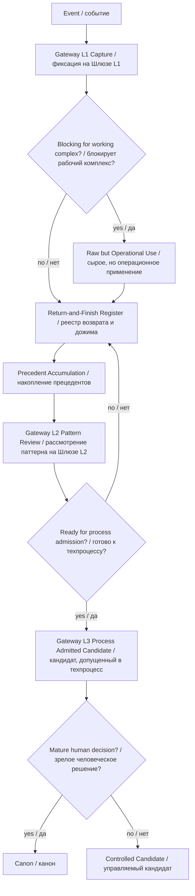

# S07 — Gateway L1 Working Integrity and Gateway Promotion Rule v0.1
## Правило работающей целостности и повышения шлюзов

```yaml
artifact_id: S07-GATEWAY-L1-WORKING-INTEGRITY-AND-GATEWAY-PROMOTION-RULE-v0.1
artifact_type: gateway_l1_candidate_pack
status: Gateway L1 Candidate / кандидат Шлюза L1
canon_status: not_canon / не канон
authority: human_approved_for_candidate_fixation
human_approval: required_before_promotion
created_for: IPaC_NIR_SEMANTIC_OS / Wise Supervisor deployment track
language_config: ru
machine_terms_policy: English term must include Russian translation in parentheses
precedent_basis:
  - S05 Resource Store Boundary and Single Markdown Bundle Policy
  - S06 Return-and-Finish Register and Priority Classifier
  - W03 Project Resource Store upload limit incident
  - S06 manual Git transaction after script safety false positive
intended_git_path: 09_SOURCE_PACKAGES/ws07/S07_GATEWAY_L1_WORKING_INTEGRITY_AND_GATEWAY_PROMOTION_RULE_v0_1.md
```

---

# 0. Назначение

Этот документ фиксирует **Gateway L1 Candidate (кандидат Шлюза L1)** для правила:

```text
Working Integrity Principle
(принцип работающей целостности)
```

и связанного процесса:

```text
Gateway Promotion
(повышение шлюзов)
```

Документ не является canon (каноном).  
Он фиксирует рабочее знание, полученное в ходе живого развёртывания Wise Supervisor (Мудрого Супервизора) и Resource Store (ресурсного хранилища) Project (проекта).

---

# 1. Фактографическая основа

## 1.1 W03-прецедент

При подготовке W03 / S03 test pack (тестового пакета W03 / S03) была выявлена практическая граница Resource Store (ресурсного хранилища) Project (проекта): 34 исходных файла оказались слишком дорогой единицей загрузки при ограниченном file budget (файловом бюджете).

Это привело к S05:

```text
Resource Store Boundary and Single Markdown Bundle Policy
(граница ресурсного хранилища и политика единой Markdown-сборки)
```

Главное открытие S05:

```text
Project file (файл проекта) — дорогой слот ресурсного хранилища.
Один хорошо структурированный Markdown Bundle (Markdown-сборка)
может содержать много virtual Memory Pages (виртуальных страниц памяти).
```

## 1.2 S06-прецедент

После S05 был выявлен следующий долг: простое поле `open_debts` (открытые долги) недостаточно.  
Открытый долг должен попадать в Return-and-Finish Register (реестр возврата и дожима) с классификатором срочности, важности, зрелости, риска потери и следующего действия.

Это привело к S06:

```text
Return-and-Finish Register and Priority Classifier
(реестр возврата и дожима и классификатор приоритетов)
```

Главное открытие S06:

```text
Open debt (открытый долг) без реестровой записи —
это не управляемый долг, а риск потери смысла.
```

## 1.3 Текущий прецедент

Во время работы стало видно, что шлюзование уже действует как техпроцесс:

```text
Мы не бросаем основную работу ради полной канонической проработки каждого нового открытия.
Мы фиксируем сильный прецедент на Gateway L1 (Шлюзе L1),
оставляем Return-and-Finish entry (запись возврата и дожима),
и продолжаем сборку рабочего комплекса.
```

Это стало основанием для S07.

---

# 2. Decision Candidate (кандидат решения)

## 2.1 Решение-кандидат

```text
Новые значимые открытия, возникающие в ходе живой работы,
не должны автоматически останавливать основной техпроцесс
для полной немедленной проработки.
```

Вместо этого применяется шлюзование:

```text
Gateway L1 (Шлюз L1): быстро зафиксировать ценный прецедент.
Gateway L2 (Шлюз L2): обобщить по пакету прецедентов.
Gateway L3 (Шлюз L3): допустить в техпроцесс под контролем.
Canon (канон): фиксировать только после зрелого решения.
```

## 2.2 Главная формула

```text
Не ждать идеального фрагмента.
Собирать работающий комплекс.
Шлюзовать честно.
Дожимать по прецедентам.
Канонизировать только после зрелого решения.
```

## 2.3 Статус

```text
Gateway L1 Candidate (кандидат Шлюза L1), not canon (не канон).
```

---

# 3. Working Integrity Principle (принцип работающей целостности)

## 3.1 Формулировка

```text
Лучше собрать работающий целостный комплекс на временных крепях,
чем бесконечно полировать отдельный фрагмент вне комплекса.
```

## 3.2 Почему

Работающий комплекс показывает:

```text
где реальные швы;
где недостающие интерфейсы;
где смысловая нагрузка;
где сбой маршрутизации;
где нужна доработка;
что действительно работает;
что было умозрительной красивостью.
```

Изолированный polished artifact (отполированный артефакт) может быть красивым, но непригодным для конечного результата.

## 3.3 Антипринцип

```text
Premature Perfectionism
(преждевременный перфекционизм)
```

Опасность:

```text
создаётся красивый, но не встроенный Artifact (артефакт);
теряется темп;
теряется целостность;
новые открытия не проходят проверку реальным техпроцессом;
Project (проект) превращается в музей фрагментов, а не в смысловую машину.
```

---

# 4. Gateway Promotion Model (модель повышения шлюзов)

## 4.1 Gateway L1 (Шлюз L1)

```yaml
role: capture valuable precedent quickly
перевод: быстро зафиксировать ценный прецедент
status: Gateway L1 Candidate / кандидат Шлюза L1
use_when:
  - обнаружен сильный практический прецедент
  - знание важно, но ещё сырое
  - нельзя останавливать основной техпроцесс
  - нужна защита от потери смысла
required_minimum:
  - title / название
  - source_event / исходное событие
  - why_it_matters / почему важно
  - candidate_formula / формула-кандидат
  - return_entry / запись возврата
  - canon_status: not_canon / не канон
```

## 4.2 Gateway L2 (Шлюз L2)

```yaml
role: consolidate multiple precedents into a reviewed pattern
перевод: обобщить несколько прецедентов в рассмотренный паттерн
status: reviewed_pattern_candidate / рассмотренный паттерн-кандидат
entry_conditions:
  - минимум несколько сходных прецедентов
  - или один критический прецедент с повторяемой операционной структурой
  - есть Return-and-Finish Register (реестр возврата и дожима)
  - есть review notes (заметки рассмотрения)
outputs:
  - rule candidate / кандидат правила
  - process candidate / кандидат процесса
  - diagrams / схемы
  - acceptance checks / проверки приёмки
```

## 4.3 Gateway L3 (Шлюз L3)

```yaml
role: admit candidate into controlled technical process
перевод: допустить кандидата в управляемый техпроцесс
status: process_admitted_candidate / кандидат, допущенный в техпроцесс
entry_conditions:
  - понятны границы применения
  - есть rollback / откат
  - есть acceptance checks / проверки приёмки
  - есть owner / ответственный контур
  - есть risk notes / заметки риска
outputs:
  - controlled operating rule / управляемое операционное правило
  - deployment addendum / аддендум развёртывания
  - update to supervisor state model / обновление модели состояния супервизора
```

## 4.4 Canon (канон)

```yaml
role: historical fixation of mature decision
перевод: историческая фиксация зрелого решения
entry_conditions:
  - explicit human decision / явное человеческое решение
  - reviewed precedent set / рассмотренный набор прецедентов
  - no unresolved critical contradictions / нет незакрытых критических противоречий
  - Git transaction / Git-проводка
status: canon / канон
```

---

# 5. Exception: Raw but Operational Complex (сырой, но операционный комплекс)

Иногда целостный комплекс должен быть допущен уже на Gateway L1 (Шлюзе L1), если без него нельзя продолжать работу.

Допустимые статусы:

```text
raw_but_operational
(сырой, но операционный)

scaffolded_complex
(комплекс на временных крепях)

candidate_in_live_process
(кандидат в живом процессе)
```

Ограничение:

```text
Такой комплекс нельзя называть canon (каноном).
Его можно использовать только с явной маркировкой статуса,
risk notes (заметками риска) и Return-and-Finish entry
(записью возврата и дожима).
```

---

# 6. Process (процесс)

```text
Event (событие)
→ L1 Capture (фиксация на Шлюзе L1)
→ Continue Working Complex (продолжение сборки рабочего комплекса)
→ Return-and-Finish Register (реестр возврата и дожима)
→ Precedent Accumulation (накопление прецедентов)
→ L2 Pattern Review (рассмотрение паттерна на Шлюзе L2)
→ L3 Process Admission (допуск в техпроцесс на Шлюзе L3)
→ Possible Canon Decision (возможное каноническое решение)
```

---

# 7. Priority and Gateway Matrix (матрица приоритетов и шлюзов)

| Priority (приоритет) | Meaning (смысл) | Default Gateway (шлюз по умолчанию) | Action (действие) |
|---|---|---|---|
| P0 — BLOCKER (блокирующее) | Без этого нельзя продолжать | L1 with live operational use (L1 с живым использованием) | Зафиксировать и применить под контролем |
| P1 — URGENT FINISH (срочно дожать) | Опасно оставить хвостом | L1 → fast review (быстрый review) | Дожать в ближайшей сессии |
| P2 — ARCHITECTURE DEBT (архитектурный долг) | Важное архитектурное знание | L1 → L2 after precedents (L2 после прецедентов) | Вернуться в следующем спринте |
| P3 — RESEARCH SEED (исследовательское зерно) | Ценная идея без срочности | L1 parking / register (парковка / реестр) | Сохранить, не мешать текущей работе |
| P4 — SPECULATIVE PARKING (умозрительная парковка) | Может пригодиться | Parking Lot (парковка) | Не тянуть в активный процесс |

---

# 8. Anti-Patterns (антипаттерны)

## 8.1 Premature Canonization (преждевременная канонизация)

```text
Называть сырое открытие canon (каноном) до review (рассмотрения),
decision (решения) и Git transaction (Git-проводки).
```

## 8.2 Premature Perfectionism (преждевременный перфекционизм)

```text
Останавливать рабочий комплекс ради бесконечной полировки одного фрагмента.
```

## 8.3 Orphan Artifact (сиротский артефакт)

```text
Создать сильный Artifact (артефакт), но не связать его с process (процессом),
Return-and-Finish Register (реестром возврата и дожима), status (статусом)
и provenance (происхождением).
```

## 8.4 Git Vacuum Cleaner (Git-пылесос)

```text
Добавлять в Git (Гит) всё подряд без точного staged set (подготовленного набора).
```

---

# 9. Mermaid Diagram (Mermaid-диаграмма)



---

# 10. Return-and-Finish Register Entries (записи реестра возврата и дожима)

## RFR-2026-06-28-004

```yaml
id: RFR-2026-06-28-004
title: Working Integrity and Gateway Promotion Rule
перевод: правило работающей целостности и повышения шлюзов
status: fixed_as_gateway_l1_candidate
priority: P2_ARCHITECTURE_DEBT
urgency: next_sprint
source_artifact: S07-GATEWAY-L1-WORKING-INTEGRITY-AND-GATEWAY-PROMOTION-RULE-v0.1
next_action: collect next precedents and promote to Gateway L2 if pattern holds
risk_if_lost: return to either premature canonization or premature perfectionism
```

## RFR-2026-06-28-005

```yaml
id: RFR-2026-06-28-005
title: Tool logging stream vs command output stream
перевод: поток журнала инструмента против потока вывода команды
status: open
priority: P2_ARCHITECTURE_DEBT
urgency: next_sprint
next_action: formulate safe Git scripting rule after additional script precedents
risk_if_lost: safety guard may misread its own log as Git state
```

---

# 11. Acceptance Checks (проверки приёмки)

Для применения правила на Gateway L1 (Шлюзе L1) проверяется:

```text
[ ] Новое знание имеет source_event (исходное событие).
[ ] Статус явно не canon (не канон).
[ ] Есть why_it_matters (почему важно).
[ ] Есть Return-and-Finish entry (запись возврата и дожима).
[ ] Есть next_action (следующее действие).
[ ] Есть risk_if_lost (риск потери).
[ ] Текущий рабочий комплекс не остановлен без необходимости.
```

Для повышения к Gateway L2 (Шлюзу L2):

```text
[ ] Есть несколько прецедентов или один критический повторяемый паттерн.
[ ] Есть review (рассмотрение).
[ ] Есть candidate rule / process (кандидат правила / процесса).
[ ] Есть Mermaid / схема процесса, если процесс сложный.
```

Для Gateway L3 (Шлюза L3):

```text
[ ] Есть контролируемое применение в техпроцессе.
[ ] Есть rollback / откат.
[ ] Есть operator instruction / инструкция оператора.
[ ] Есть acceptance criteria / критерии приёмки.
```

---

# 12. Proposed Placement (предлагаемое размещение)

Текущая фиксация как source package (исходный пакет):

```text
09_SOURCE_PACKAGES/ws07/S07_GATEWAY_L1_WORKING_INTEGRITY_AND_GATEWAY_PROMOTION_RULE_v0_1.md
```

При повышении к Gateway L2 (Шлюзу L2) возможные целевые артефакты:

```text
06_PROJECT_RULES/WORKING_INTEGRITY_AND_GATEWAY_PROMOTION_RULE_v0_1.md
02_REGISTERS/RETURN_AND_FINISH_REGISTER_v0_1.md
08_TRACE_AND_DECISIONS/decisions/DECISION_2026-06-28_WORKING_INTEGRITY_GATEWAY_PROMOTION_v0_1.md
```

---

# 13. Proposed Git Transaction (предложенная Git-проводка)

```powershell
git status --short
git add -- "09_SOURCE_PACKAGES/ws07/S07_GATEWAY_L1_WORKING_INTEGRITY_AND_GATEWAY_PROMOTION_RULE_v0_1.md"
git diff --cached --name-status
git commit -m "resources: add working integrity gateway promotion rule s07"
git push
git status --short
git log --oneline -5
```

---

# 14. Current Status (текущий статус)

```text
S07_GATEWAY_L1_CANDIDATE_READY
WORKING_INTEGRITY_PRINCIPLE_CAPTURED
GATEWAY_PROMOTION_MODEL_CAPTURED
RETURN_AND_FINISH_ENTRIES_CAPTURED
NOT_CANON
```

