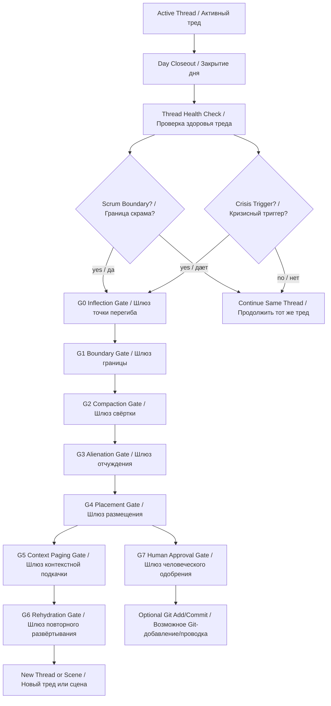

# Appendix A — Process Gates for Semantic Thread Compaction and Rehydration
## Приложение A — процессные шлюзы смысловой свёртки треда и повторного развёртывания

```yaml
artifact_id: APPENDIX-A-PROCESS-GATES-SEMANTIC-THREAD-COMPACTION-REHYDRATION-2026-06-24-v0.1
artifact_type: appendix_candidate / process_gates
status: candidate
canon_status: not_canon
parent_document: PROCESS_REGULATION_SEMANTIC_THREAD_COMPACTION_REHYDRATION_candidate_v0_1.md
created: 2026-06-24
```

---

# A1. Gate Table (таблица шлюзов)

| Gate (шлюз) | Назначение | PASS (проход) | FAIL (сбой) |
|---|---|---|---|
| G0 — Inflection Gate (шлюз точки перегиба) | Понять, что ситуация изменилась | Перегиб назван и маршрутизирован | Перегиб проигнорирован |
| G1 — Boundary Gate (шлюз границы) | Определить границу сегмента | Включения и исключения названы | Сегмент размыт |
| G2 — Compaction Gate (шлюз свёртки) | Сохранить рабочую смысловую способность | Факты, решения, долги, статусы сохранены | Получился summary (краткий пересказ) |
| G3 — Alienation Gate (шлюз отчуждения) | Вывести смысл в artifact (артефакт) | Есть Markdown Artifact (Markdown-артефакт), Resource Entry (ресурсная запись), QA (контроль качества) | Смысл остался только в Thread (треде) |
| G4 — Placement Gate (шлюз размещения) | Разместить в Vault (хранилище) | Путь и статус известны | Artifact (артефакт) потерян или осиротел |
| G5 — Context Paging Gate (шлюз контекстной подкачки) | Выбрать Context Pages (страницы контекста) | Есть required pages (обязательные страницы) и forbidden noise (запрещённый шум) | Подкачан шум или не подкачан минимум |
| G6 — Rehydration Gate (шлюз повторного развёртывания) | Проверить восстановление рабочего состояния | Фокус, статусы, долги, следующий шаг восстановлены | Новый Thread (тред) не способен продолжать |
| G7 — Human Approval Gate (шлюз человеческого одобрения) | Защитить Git (Git) и canon (канон) | Явное Human Approval (человеческое одобрение) | Неявная Git-проводка или преждевременная канонизация |

---

# A2. Mermaid Scheme (Mermaid-схема)



---

# A3. Critical Distinction (критическое различение)

```text
Day Closeout (закрытие дня):
  ежедневная операционная фиксация.

Thread Cut (отсечение треда):
  смысловое закрытие крупного цикла.

Scrum Boundary (граница скрама):
  нормальная точка закрытия Thread (треда).

Crisis Trigger (кризисный триггер):
  вынужденная точка стабилизации и отсечения.
```
