# APPENDIX A — PROCESS RULE — Day Gate Close / Open First v0.1
## Приложение A — Процессное правило: сначала закрытие / открытие дня через Day Gate (дневной шлюз)

```yaml
artifact_id: RULE-DAY-GATE-CLOSE-OPEN-FIRST-v0.1
artifact_type: appendix / process_rule_candidate / day_gate / daily_transition / supervisor_operation
status: candidate
canon_status: not_canon
parent_document: IPAC_DAY_GATE_MANUAL_RUNBOOK_candidate_v0_2.md
related_diagram_embedded: true
related_diagram_file: DAY_GATE_CLOSE_OPEN_PROCESS_v0_1.mmd
related_process_description: DAY_GATE_CLOSE_OPEN_PROCESS_DESCRIPTION_2026-06-24_v0_1.md
project: IPaC_NIR_SEMANTIC_OS
parent_frame: IPaC OS Architecture Candidate
primary_required_placement: 11_COS_ARCHITECTURE_PROJECT_DECISIONS/04_PROCESS_DECISIONS/
derivative_trace_zone: 08_TRACE_AND_DECISIONS/session_notes
review_zone: 08_TRACE_AND_DECISIONS/reviews
human_approval_required: true
git_actions_authorized: false
canonization_authorized: false
created: 2026-06-24
version: 0.1
```

---

# 0. Назначение Appendix (приложения)

Это Appendix (приложение) задаёт **Process Rule (процессное правило)** для Day Gate (дневного шлюза): как должен выполняться переход от одного рабочего дня к другому, чтобы не терялась когнитивная высота, не смешивались дни и не происходило silent context bleed (скрытое перетекание контекста).

Короткая формула:

```text
Day Gate (дневной шлюз) не просто разделяет дни.
Day Gate (дневной шлюз) делает переход дня восстановимым процессом.
```

---

# 1. Process Rule Statement (формулировка процессного правила)

Каждый рабочий день, который закрывается и открывается в контуре IPaC OS (IPaC смысловой ОС), должен проходить через явный Day Gate (дневной шлюз), если:

```text
- тред достиг смысловой плотности и требует перевязки;
- нужен перенос когнитивной высоты в новый чат или новый сегмент треда;
- день завершается и должен быть закрыт как рабочая смена;
- новый день должен начаться от Thread Start Anchor (якоря начала треда);
- нужно удержать Factography first (сначала фактография) и Candidate before canon (сначала кандидат, потом канон).
```

Минимальный результат Day Gate Process (процесса дневного шлюза):

```text
1. Previous Day Qualification (квалификация предыдущего дня);
2. Day Closeout Record (запись закрытия дня);
3. Carry-over Inventory (инвентаризация переносимых хвостов);
4. Thread Start Anchor Qualification (квалификация якоря начала треда);
5. Day Gate Record (запись дневного шлюза);
6. Daily Register Opening (открытие Дневного реестра);
7. Post-check (послеоперационная проверка);
8. Human Verification (человеческая проверка);
9. explicit Git status (явный статус Git).
```

---

# 2. Область действия

Process Rule (процессное правило) применяется для:

```text
- ручного закрытия / открытия рабочего дня;
- ротации тредов и сегментов работы;
- сохранения continuity (непрерывности) Supervisor (супервизора);
- подготовки будущей автоматизации через Codex/MCP (Кодекс/MCP).
```

Process Rule (процессное правило) не применяется, если нет фактического перехода рабочего дня или если нужен только локальный separator (разделитель) без операционного смысла.

---

# 3. Roles (роли)

```text
Human Architect (человеческий архитектор): сообщает факт перехода дня, принимает candidate (кандидат), проверяет файлы, даёт одобрение на Git Action (Git-действие).
Supervisor (супервизор): держит статусы, маршрут, запреты, open debts (открытые долги), recovery logic (логику восстановления).
Run Script (исполняемый скрипт): создаёт и обновляет файлы Day Closeout (закрытия дня), Day Gate (дневного шлюза) и Daily Register (Дневного реестра).
Placement Script (скрипт размещения): размещает регламент и process companion files (сопутствующие файлы процесса) в Vault (хранилище).
Vault (хранилище): ассоциативно-семантическая память.
Git (Git): фиксирующе-храповиковая память и provenance anchor (якорь происхождения).
```

---

# 4. Main Route (главный маршрут)

```text
0. Status Guard (статусный предохранитель)
1. Receive Day Transition Fact (получить факт перехода дня)
2. Pre-check Git Status (предварительно проверить статус Git)
3. Qualify Previous Day (квалифицировать предыдущий день)
4. Create Day Closeout (создать закрытие дня)
5. Extract Carry-over (извлечь переносимые хвосты)
6. Qualify Thread Start Anchor (квалифицировать якорь начала треда)
7. Create Day Gate (создать дневной шлюз)
8. Open Daily Register / Ship Log (открыть Дневной реестр / Бортовой журнал)
9. Append Opening Event (дописать событие открытия)
10. Post-check changed files (проверить изменённые файлы)
11. Human Verification (человеческая проверка)
12. optional Git Add / Commit (возможное Git-добавление / Git-проводка)
13. Backtrace / Save Point (обратная трассировка / точка сохранения)
```

---

# 5. Mermaid Process Scheme (Mermaid-схема процесса)

```mermaid
flowchart TD
    START(["Day Transition Trigger / Сигнал перехода дня"])

    subgraph S0["0. Status Guard / Статусный предохранитель"]
        A0["Set status<br/>candidate (кандидат), not_canon (не канон)"]
        A1["Block automatic Git Action<br/>Запретить автоматическое Git-действие"]
    end

    subgraph S1["1. Day Transition Intake / Приём перехода дня"]
        B0["Receive human fact<br/>Получить факт от человека"]
        B1["Identify dates and time<br/>Определить даты и время"]
        B2["Identify Thread Start Anchor<br/>Определить якорь начала треда"]
    end

    subgraph S2["2. Pre-check / Предварительная проверка"]
        C0["Read live Git status<br/>Считать живой статус Git"]
        C1{"Anchor file loaded?<br/>Файл якоря подкачан?"}
        C2["Mark anchor as human_reported_fact<br/>Отметить якорь как human_reported_fact"]
        C3["Use file contents carefully<br/>Использовать содержимое файла аккуратно"]
    end

    subgraph S3["3. Previous Day Closure / Закрытие предыдущего дня"]
        D0["Qualify previous day<br/>Квалифицировать предыдущий день"]
        D1["Create DAY_CLOSEOUT file<br/>Создать файл DAY_CLOSEOUT"]
        D2["Extract carry-over<br/>Извлечь переносимые хвосты"]
    end

    subgraph S4["4. Current Day Opening / Открытие текущего дня"]
        E0["Create DAY_GATE file<br/>Создать файл DAY_GATE"]
        E1["Open DAILY_REGISTER file<br/>Открыть файл DAILY_REGISTER"]
        E2["Append opening event<br/>Добавить событие открытия"]
    end

    subgraph S5["5. Verification / Проверка"]
        F0["Post-check changed files<br/>Проверить изменённые файлы"]
        F1{"Files valid?<br/>Файлы корректны?"}
        F2["Correction pass<br/>Исправительный проход"]
        F3["Human verification<br/>Человеческая проверка"]
    end

    subgraph S6["6. Placement and Git / Размещение и Git"]
        G0["Store artifacts in Vault<br/>Сохранить артефакты в Vault"]
        G1{"Git action approved?<br/>Git-действие одобрено?"}
        G2["Optional Git add<br/>Возможное Git-добавление"]
        G3["Optional Git commit<br/>Возможная Git-проводка"]
        G4["Backtrace / Save Point<br/>Обратная трассировка / точка сохранения"]
    end

    START --> A0 --> A1 --> B0 --> B1 --> B2 --> C0 --> C1
    C1 -- "No / нет" --> C2 --> D0
    C1 -- "Yes / да" --> C3 --> D0
    D0 --> D1 --> D2 --> E0 --> E1 --> E2 --> F0 --> F1
    F1 -- "No / нет" --> F2 --> D1
    F1 -- "Yes / да" --> F3 --> G0 --> G1
    G1 -- "No / нет" --> G4
    G1 -- "Yes / да" --> G2 --> G3 --> G4
```



---

# 6. Phase Details (детали фаз)

## Phase 0 — Status Guard (статусный предохранитель)

```text
status = candidate (кандидат)
canon_status = not_canon (не канон)
git_actions_authorized = false
human_approval_required = true
```

## Phase 1 — Day Transition Intake (приём перехода дня)

Зафиксировать:

```text
- previous_date (предыдущую дату);
- current_date (текущую дату);
- opening_time (время открытия);
- thread_start_anchor (якорь начала треда);
- human fact source (человеческий источник факта).
```

## Phase 2 — Pre-check (предварительная проверка)

Проверить Git status (статус Git). Если anchor (якорь) не подкачан, не симулировать чтение.

## Phase 3 — Previous Day Closure (закрытие предыдущего дня)

Создать Day Closeout (закрытие дня) и явно зафиксировать carry-over (переносимые хвосты).

## Phase 4 — Current Day Opening (открытие текущего дня)

Создать Day Gate (дневной шлюз), открыть Daily Register (Дневной реестр), зафиксировать opening event (событие открытия).

## Phase 5 — Verification (проверка)

Проверить созданные файлы и их статусы. При ошибках — correction pass (исправительный проход).

## Phase 6 — Placement and Git (размещение и Git)

Разместить файлы. Git add / commit (Git-добавление / Git-проводка) — только после отдельного Human Approval (человеческого одобрения).

---

# 7. Completion Criteria (критерии завершения)

Процесс считается завершённым на уровне candidate day transition (кандидатного перехода дня), если:

```text
[PASS] DAY_CLOSEOUT создан;
[PASS] DAY_GATE создан;
[PASS] DAILY_REGISTER открыт или дополнен;
[PASS] opening event (событие открытия) записано;
[PASS] Mermaid Process Scheme (Mermaid-схема процесса) существует как embedded diagram (встроенная схема) и как отдельный .mmd;
[PASS] статус candidate (кандидат), not_canon (не канон) удержан;
[PASS] Git commit (Git-проводка) не выполнена без Human Approval (человеческого одобрения).
```

---

# 8. Status (статус)

```text
APPENDIX_STATUS: candidate
CANON_STATUS: not_canon
GIT_ACTIONS_AUTHORIZED: false
HUMAN_APPROVAL_REQUIRED: true
```
